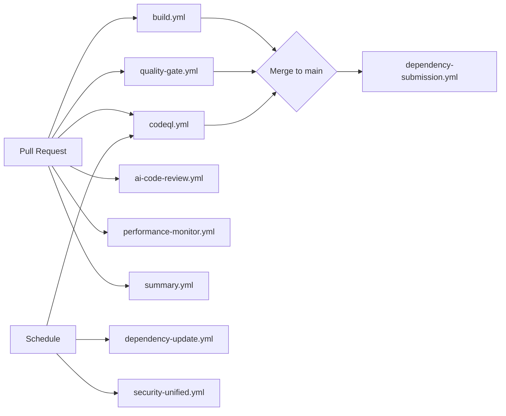

# CI/CD Workflows Documentation

This document describes the GitHub Actions workflows that automate testing, security scanning, quality enforcement, and publishing for the Transformation Portal repository.

## Table of Contents

- [Overview](#overview)
- [Workflow Categories](#workflow-categories)
- [Security & Quality Workflows](#security--quality-workflows)
- [Dependency Management](#dependency-management)
- [Development Support](#development-support)
- [Publishing Workflows](#publishing-workflows)
- [Permissions Policy](#permissions-policy)
- [Workflow Dependencies](#workflow-dependencies)
- [Troubleshooting](#troubleshooting)

## Overview

The repository uses **14 GitHub Actions workflows** for continuous integration, security scanning, and automation. All workflows follow the least-privilege principle for token permissions and are designed to run efficiently with appropriate caching.

### Quick Reference

| Workflow | Trigger | Purpose | Duration |
|----------|---------|---------|----------|
| `build.yml` | Push, PR | Linting & tests (3.10/3.11/3.12) | ~5-8 min |
| `quality-gate.yml` | Push, PR | Pre-commit checks | ~2-3 min |
| `codeql.yml` | Push, Schedule | Security scanning | ~10-15 min |
| `security-unified.yml` | Push, Schedule | Comprehensive security | ~8-12 min |
| `dependency-submission.yml` | Push to main | Dependency graph update | ~2 min |
| `dependency-update.yml` | Schedule | Automated dependency PRs | ~3-5 min |
| `ai-code-review.yml` | PR | Automated code review | ~2-4 min |
| `performance-monitor.yml` | Push, PR | Performance regression | ~5-7 min |

## Workflow Categories

### Security & Quality Workflows

These workflows ensure code quality, security posture, and compliance with project standards.

#### `build.yml` - Main CI Pipeline

**Triggers**: Push to any branch, Pull requests
**Permissions**: `contents: read`

**Purpose**: Primary continuous integration pipeline that validates code quality and correctness.

**What it does**:
- **Linting**:
  - flake8 for critical Python errors (line length: 127 chars)
  - pylint for code quality warnings (non-blocking)
- **Testing**:
  - pytest with coverage reporting
  - Test matrix: Python 3.10, 3.11, 3.12
  - Parallel test execution with pytest-xdist when available
- **Manifest Validation**:
  - Validates `pyproject.toml`, `requirements.txt`, and dependency files
  - Checks for dependency conflicts and version constraints

**Key Features**:
- Disk space cleanup before tests (ML models are large)
- Dependency caching for faster runs
- Coverage reports uploaded to codecov (if configured)
- Excludes deprecated code from linting: `deprecated/`, `src/transformation_portal/`, `scripts/`

**Failure Conditions**:
- Linting errors (flake8 E9, F63, F7, F82)
- Test failures
- Coverage drops below threshold (if configured)
- Invalid dependency manifest

---

#### `quality-gate.yml` - Pre-Commit Validation

**Triggers**: Push to any branch, Pull requests
**Permissions**: `contents: read`, `pull-requests: read`

**Purpose**: Enforces repository organization and code formatting standards before merge.

**What it does**:
- **File Organization**:
  - Validates root directory cleanliness (max 10 markdown files)
  - Checks for misplaced files (data files, scripts, outputs in root)
- **Code Formatting**:
  - Trailing whitespace detection
  - Line length validation (127 chars max)
  - Consistent indentation
- **Repository Structure**:
  - Ensures proper directory hierarchy
  - Validates file classification

**Known Issues**:
- Contains local-only git commit step (Issue #761) - safe but redundant

---

#### `codeql.yml` - CodeQL Security Scanning

**Triggers**: Push to main/develop, Pull requests, Weekly schedule (Mondays)
**Permissions**: `security-events: write`, `packages: read`, `contents: read`, `actions: read`

**Purpose**: Automated vulnerability detection using GitHub's CodeQL engine.

**What it does**:
- **Static Analysis**:
  - Scans Python codebase for security vulnerabilities
  - Detects CWE patterns (SQL injection, XSS, path traversal, etc.)
  - Identifies unsafe API usage
- **Configuration**:
  - Queries: `security-extended` (comprehensive coverage)
  - Build mode: `none` (Python doesn't require compilation)
- **Reporting**:
  - Results published to Security tab
  - PR annotations for new vulnerabilities
  - Sarif upload for integration with other tools

**Recent Fixes**:
- Added proper `permissions:` block (Jan 2026, commit 38d175b8)
- Fixed duplicate permissions block (Jan 2026, commit aa555e0a)

---

#### `security-unified.yml` - Unified Security Scanning

**Triggers**: Push to main, Pull requests, Schedule
**Permissions**: `contents: read`, `security-events: write`

**Purpose**: Comprehensive security scanning combining multiple tools.

**What it does**:
- Dependency vulnerability scanning
- Secret detection
- License compliance checking
- Container image scanning (if Docker images present)

---

#### `enforcement.yml` - Quality Enforcement

**Triggers**: Push to main, Pull requests
**Permissions**: `contents: read`

**Purpose**: Enforces project-specific quality standards and coding conventions.

**What it does**:
- Validates decision annotations (allow_*, decision_*)
- Checks for temporal contract compliance
- Enforces architectural guidelines
- Validates documentation completeness

---

### Dependency Management

#### `dependency-submission.yml` - Dependency Graph Submission

**Triggers**: Push to main branch only
**Permissions**: `contents: write`

**Purpose**: Keeps GitHub's dependency graph up-to-date for vulnerability alerts.

**What it does**:
- Parses `requirements.txt` and `pyproject.toml`
- Submits dependency list to GitHub Dependency Graph API
- Enables Dependabot alerts for vulnerable dependencies

**Why write permission?**:
Dependency graph submission requires `contents: write` to update repository metadata.

---

#### `dependency-update.yml` - Automated Dependency Updates

**Triggers**: Weekly schedule (Mondays 9 AM UTC)
**Permissions**: `contents: write`, `pull-requests: write`

**Purpose**: Automated PRs for dependency updates and security patches.

**What it does**:
- Checks for outdated dependencies using `pip list --outdated`
- Creates PRs for minor/patch version updates
- Separates security updates (high priority) from feature updates
- Runs tests before creating PR

**Recent Updates**:
- virtualenv: 20.35.4 → 20.36.1 (Jan 2026, Dependabot #759)
- protobuf: Fixed CVE-2026-0994 (Jan 2026, Dependabot #69)

---

### Development Support

#### `ai-code-review.yml` - AI-Powered Code Review

**Triggers**: Pull requests
**Permissions**: `contents: read`, `pull-requests: write`, `issues: write`

**Purpose**: Automated code review using AI to catch common issues early.

**What it does**:
- Reviews PR diffs for:
  - Code quality issues
  - Potential bugs
  - Performance concerns
  - Security vulnerabilities
  - Documentation gaps
- Posts review comments directly on PR
- Suggests improvements with code snippets

---

#### `issue_printer.yml` - Issue Metadata Logging

**Triggers**: Issue creation/update
**Permissions**: `contents: read`

**Purpose**: Logs issue metadata for analytics and tracking.

**What it does**:
- Extracts issue metadata (labels, assignees, milestones)
- Logs structured data for analysis
- Enables custom issue analytics

---

#### `smart-issue-management.yml` - Automated Issue Triage

**Triggers**: Issue creation/update, Schedule
**Permissions**: `issues: write`, `contents: read`

**Purpose**: Automated issue labeling, assignment, and prioritization.

**What it does**:
- Auto-labels issues based on content analysis
- Assigns issues to relevant team members
- Detects duplicate issues
- Marks stale issues for closure
- Prioritizes security and bug reports

---

#### `performance-monitor.yml` - Performance Regression Detection

**Triggers**: Push to main, Pull requests
**Permissions**: `contents: read`

**Purpose**: Detects performance regressions in depth pipeline and image processing.

**What it does**:
- Runs performance benchmarks:
  - Depth estimation speed (target: 24-65ms)
  - Batch processing throughput (target: 400-600 images/hour)
  - Memory usage profiling
- Compares against baseline performance
- Fails if regression exceeds threshold (>10% slowdown)
- Posts performance report as PR comment

---

### Publishing Workflows

#### `submit-pypi.yml` - PyPI Package Publishing

**Triggers**: Manual (workflow_dispatch), Release creation
**Permissions**: `contents: read`

**Purpose**: Publishes Transformation Portal package to PyPI.

**What it does**:
- Builds source distribution and wheel
- Validates package metadata
- Uploads to PyPI using trusted publishing
- Creates GitHub release with assets

**Security**:
- Uses PyPI trusted publishing (no API tokens in secrets)
- Requires manual approval for production releases

---

#### `python-app.yml` - Legacy Python Application Workflow

**Triggers**: Push, Pull requests
**Permissions**: `contents: read`

**Purpose**: Legacy workflow for backward compatibility.

**Status**: Retained for historical reasons; consider removal if `build.yml` fully replaces functionality.

---

#### `summary.yml` - PR Summary Generation

**Triggers**: Pull request creation/update
**Permissions**: `pull-requests: write`, `contents: read`

**Purpose**: Generates comprehensive PR summaries and metadata.

**What it does**:
- Analyzes PR changes (files modified, lines changed)
- Generates summary comment with:
  - Changed files by category
  - Test coverage impact
  - Documentation changes
  - Migration notes
- Updates summary on each push

---

## Permissions Policy

All workflows follow GitHub's **least-privilege security model**:

### Default Permissions
- **`contents: read`** - Read-only repository access (default for most workflows)
- Workflows explicitly request additional permissions only when required

### Write Permissions (Justified)

| Workflow | Permission | Justification |
|----------|------------|---------------|
| `dependency-submission.yml` | `contents: write` | Dependency graph API requires write access |
| `dependency-update.yml` | `contents: write`, `pull-requests: write` | Creates automated PRs |
| `ai-code-review.yml` | `pull-requests: write` | Posts review comments |
| `codeql.yml` | `security-events: write` | Uploads security scan results |
| `security-unified.yml` | `security-events: write` | Uploads vulnerability data |
| `smart-issue-management.yml` | `issues: write` | Auto-labels and assigns issues |
| `summary.yml` | `pull-requests: write` | Posts summary comments |

### Recent Security Hardening (Jan 2026)
- Fixed duplicate `permissions:` block in quality-gate.yml (aa555e0a)
- Standardized permissions across all workflows (baf69e04)
- Added explicit permission declarations to prevent over-privileged tokens

---

## Workflow Dependencies

### Workflow Orchestration



### Required Checks for Merge

The following workflows **must pass** before merging to main:
1. ✅ `build.yml` - All tests pass, no linting errors
2. ✅ `quality-gate.yml` - Repository organization valid
3. ✅ `codeql.yml` - No new security vulnerabilities

Optional but recommended:
- `ai-code-review.yml` - Review suggestions addressed
- `performance-monitor.yml` - No performance regressions

---

## Troubleshooting

### Common Workflow Failures

#### `build.yml` fails with "No space left on device"
**Cause**: ML models (Depth Anything V2, Stable Diffusion) consume large amounts of disk space.

**Fix**: Workflow already includes disk cleanup step. If still failing:
```yaml
- name: Free Disk Space
  run: |
    df -h
    sudo rm -rf /usr/local/lib/android
    sudo rm -rf /usr/share/dotnet
    df -h
```

---

#### `codeql.yml` times out
**Cause**: CodeQL analysis can be slow on large repositories.

**Fix**: Already configured with optimized settings. If timeout persists:
- Reduce query suite from `security-extended` to `security-and-quality`
- Enable incremental analysis (only scan changed files)

---

#### `quality-gate.yml` reports "Too many markdown files in root"
**Cause**: Root directory contains more than 10 markdown files.

**Fix**:
1. Move documentation to `docs/` subdirectories
2. Keep only essential docs in root (README, SECURITY, REPO_ORGANIZATION)
3. Current count: 7/10 files

**Allowed in root**:
- README.md
- SECURITY.md
- REPO_ORGANIZATION.md
- CACHE_VALIDATION_IMPLEMENTATION.md
- DA3_IMPLEMENTATION_SUMMARY.md
- PR_SUMMARY_LUX_DEPTH_V3.md
- DOCUMENTATION_REVIEW_REPORT.md

---

#### `dependency-submission.yml` fails with 403 Forbidden
**Cause**: Workflow lacks `contents: write` permission.

**Fix**: Already configured correctly. If still failing, check branch protection rules allow workflow writes.

---

#### Workflows skip on Dependabot PRs
**Cause**: GitHub restricts workflow permissions for Dependabot PRs by default.

**Fix**:
1. Enable "Allow GitHub Actions to create and approve pull requests" in Settings → Actions → General
2. Or manually approve Dependabot PRs to trigger workflows

---

## Best Practices

### For Contributors

1. **Run tests locally** before pushing:
   ```bash
   make test-fast  # Quick tests
   make test-full  # Full suite
   make lint       # Linting
   ```

2. **Check quality-gate requirements**:
   ```bash
   # Count root markdown files
   find . -maxdepth 1 -name "*.md" -type f | wc -l

   # Should be ≤ 10
   ```

3. **Review workflow results** in PR checks tab before requesting review

### For Maintainers

1. **Monitor workflow efficiency**:
   - Average build time should be < 10 minutes
   - Cache hit rate should be > 80%
   - Failed builds should be investigated within 24 hours

2. **Update workflows regularly**:
   - Keep GitHub Actions versions up-to-date
   - Review and update CodeQL queries quarterly
   - Audit permissions annually

3. **Security considerations**:
   - Never add `GITHUB_TOKEN` to secrets (use built-in token)
   - Minimize `contents: write` and `pull-requests: write` permissions
   - Review Dependabot alerts weekly

---

## Additional Resources

- **GitHub Actions Documentation**: https://docs.github.com/actions
- **CodeQL Query Reference**: https://codeql.github.com/docs/
- **Security Hardening Guide**: https://docs.github.com/actions/security-guides/security-hardening-for-github-actions
- **Workflow Syntax**: https://docs.github.com/actions/reference/workflow-syntax-for-github-actions

---

**Last Updated**: 2026-01-29
**Maintained By**: Transformation Portal Team
**Version**: 1.0
