# Depth Pipeline Architecture

**Version**: 2.0  
**Date**: December 2025  
**Status**: Production-Ready

---

## Overview

This document provides a comprehensive visual and textual overview of the Lux Depth V2 architecture, including data flow, component interactions, and processing stages.

---

## 1. High-Level Architecture

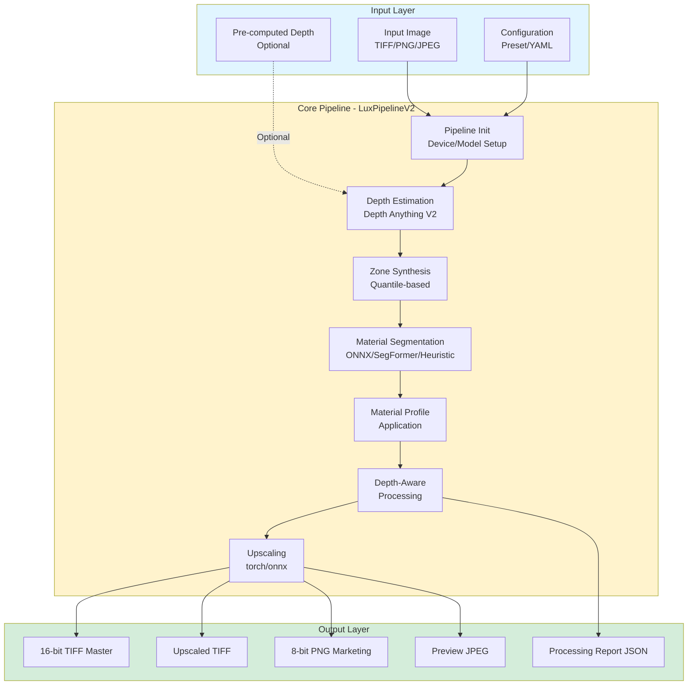

---

## 2. Detailed Processing Flow

```mermaid
flowchart TD
    START([Start]) --> LOAD[Load Image & Config]
    LOAD --> PRESET{Apply<br/>Preset?}
    PRESET -->|Yes| APPLY[Apply Preset Defaults]
    PRESET -->|No| VALIDATE
    APPLY --> VALIDATE[Validate Config]
    
    VALIDATE --> DEVICE[Select Device<br/>CUDA/MPS/CPU]
    DEVICE --> HASDDEPTH{Depth Map<br/>Provided?}
    
    HASDDEPTH -->|Yes| LOADDEPTH[Load Depth Map]
    HASDDEPTH -->|No| GENDEPTH[Generate Depth<br/>Depth Anything V2]
    
    LOADDEPTH --> NORMALIZE[Normalize Depth<br/>0-1 range]
    GENDEPTH --> NORMALIZE
    
    NORMALIZE --> ZONESYN[Zone Synthesis<br/>Foreground/Mid/Background]
    ZONESYN --> MANMASKS{Manual<br/>Masks?}
    
    MANMASKS -->|Yes| LOADMASKS[Load Zone Masks]
    MANMASKS -->|No| AUTOSYN[Auto Quantile Zones]
    
    LOADMASKS --> MATSEG
    AUTOSYN --> MATSEG[Material Segmentation]
    
    MATSEG --> BACKEND{Segmentation<br/>Backend}
    BACKEND -->|ONNX| ONNXSEG[ONNX Model]
    BACKEND -->|SegFormer| SEGFORMER[SegFormer Model]
    BACKEND -->|Heuristic| HEURISTIC[Color-based Rules]
    
    ONNXSEG --> MATPROF
    SEGFORMER --> MATPROF
    HEURISTIC --> MATPROF[Apply Material Profiles]
    
    MATPROF --> DENOISE[Depth-Aware Denoising<br/>Bilateral Filter]
    DENOISE --> TONEMAP[Zone Tone Mapping<br/>AgX/Reinhard/Filmic/ACES]
    TONEMAP --> ATMO{Atmospheric<br/>Effects?}
    
    ATMO -->|Yes| HAZE[Apply Haze/Fog]
    ATMO -->|No| CLARITY
    HAZE --> CLARITY[Clarity Enhancement<br/>Zone-weighted]
    
    CLARITY --> UPSCALEQ{Upscale<br/>Enabled?}
    UPSCALEQ -->|Yes| UPSCALER[Upscaling Backend<br/>torch/onnx]
    UPSCALEQ -->|No| EXPORT
    
    UPSCALER --> EXPORT[Export Outputs<br/>TIFF/PNG/JPEG]
    EXPORT --> TELEMETRY[Record Telemetry<br/>Timing/Memory]
    TELEMETRY --> END([End])
    
    style START fill:#90ee90
    style END fill:#90ee90
    style GENDEPTH fill:#ffd700
    style MATSEG fill:#ffd700
    style TONEMAP fill:#ffd700
    style UPSCALER fill:#ffd700
```

---

## 3. Component Architecture

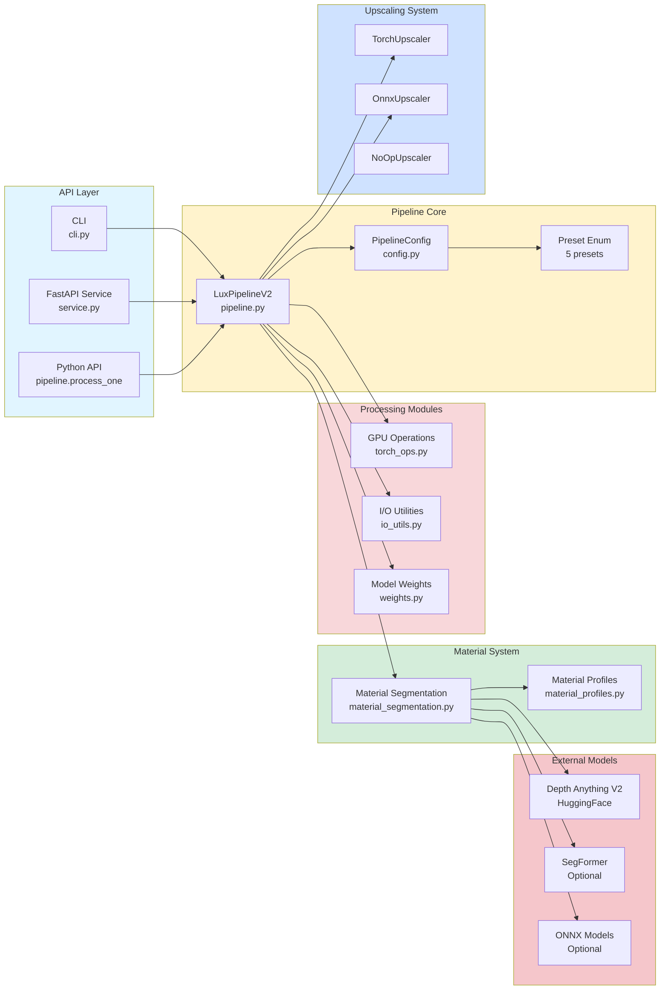

---

## 4. Depth Processing Stages

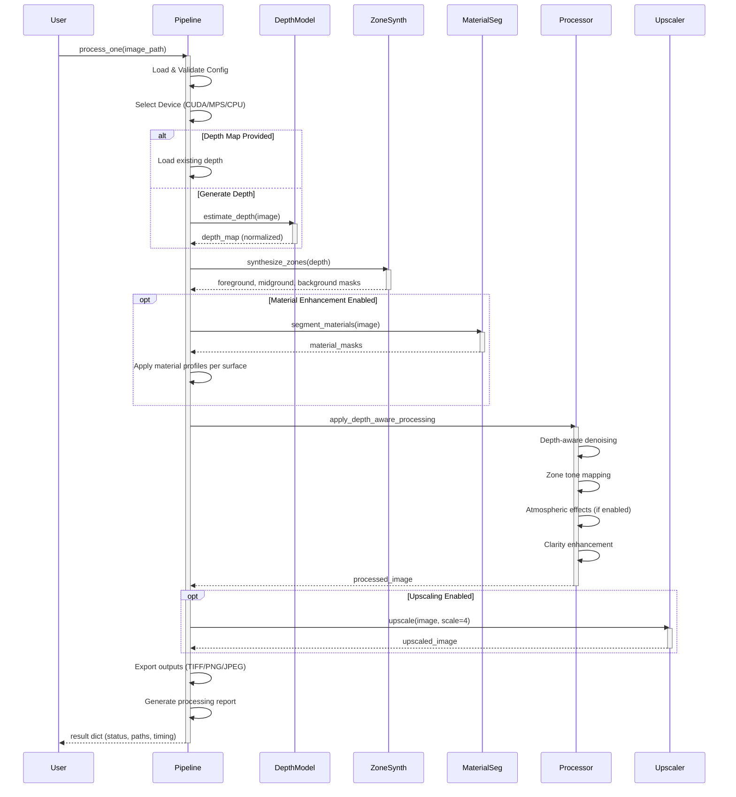

---

## 5. Preset Configuration Flow

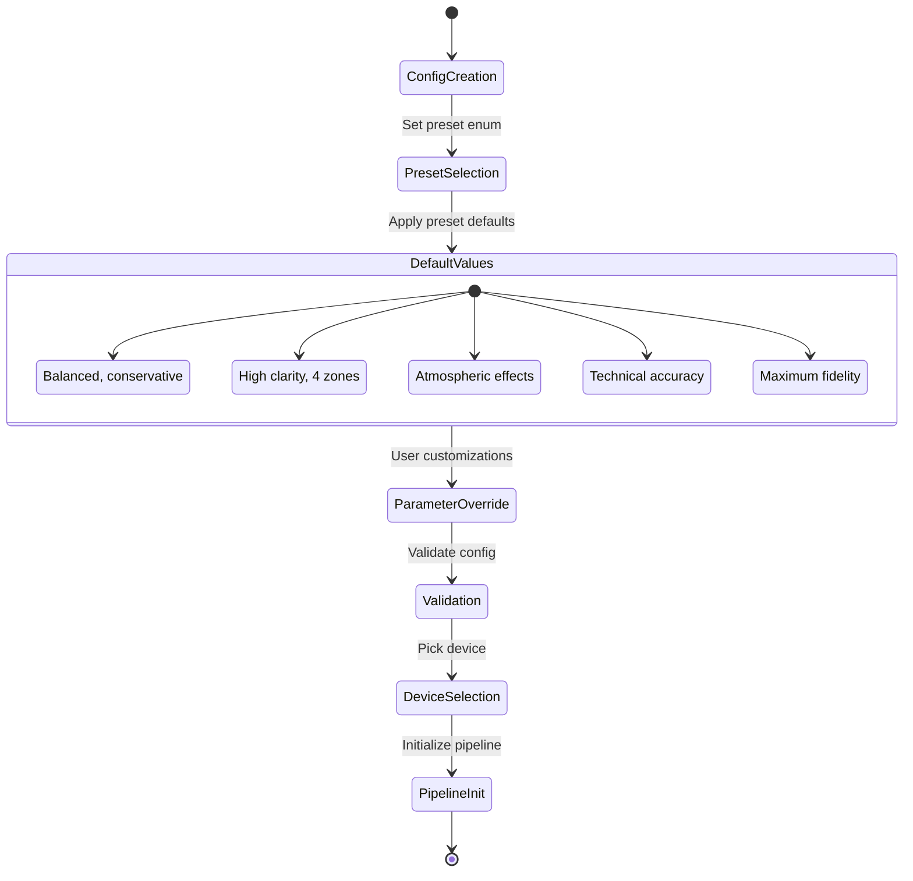

---

## 6. Material Segmentation Backends

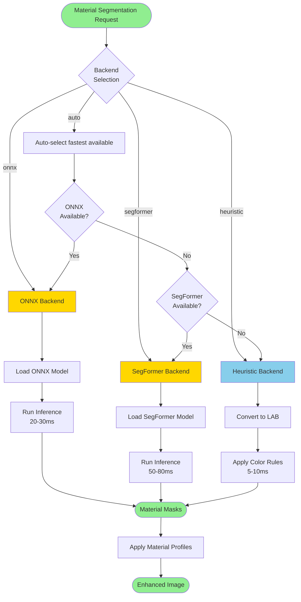

---

## 7. Zone-Based Tone Mapping

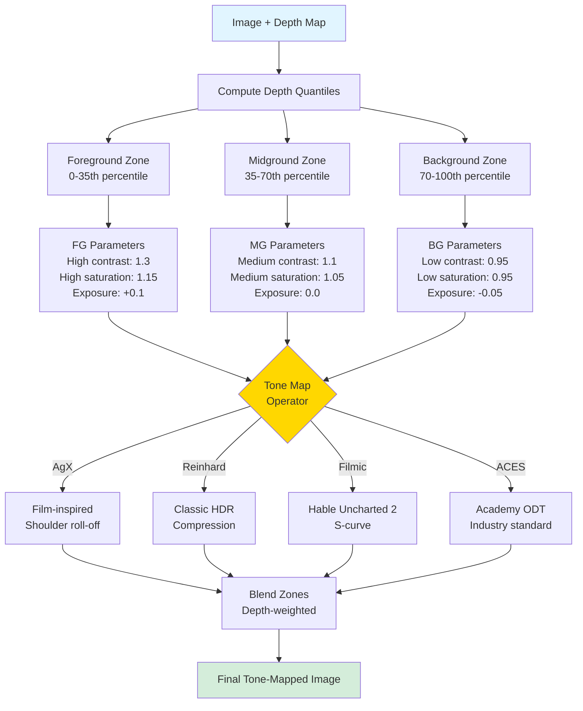

---

## 8. Data Flow Summary

### Input → Processing → Output

| Stage | Input | Processing | Output | Time (ms) |
|-------|-------|------------|--------|-----------|
| **1. Depth Estimation** | RGB Image | Depth Anything V2 inference | Depth map (normalized) | 25-65 |
| **2. Zone Synthesis** | Depth map | Quantile computation | 3-4 zone masks | 5-10 |
| **3. Material Segmentation** | RGB Image | ONNX/SegFormer/Heuristic | Material masks (6+ types) | 5-80 |
| **4. Material Profiles** | Image + Material masks | Per-material enhancements | Enhanced image | 20-40 |
| **5. Denoising** | Image + Depth | Bilateral filtering | Denoised image | 15-25 |
| **6. Tone Mapping** | Image + Zones | Zone-based operators | Tone-mapped image | 30-50 |
| **7. Atmospheric** | Image + Depth | Haze/fog simulation | Enhanced image | 10-20 |
| **8. Clarity** | Image + Zones | Zone-weighted sharpening | Sharpened image | 15-25 |
| **9. Upscaling** | Processed image | torch/onnx upscaler | 2x or 4x upscaled | 150-300 |
| **10. Export** | Final image | TIFF/PNG/JPEG encoding | Output files | 50-100 |

**Total End-to-End**: 300-500ms per image (1024×1024, 4x upscale, CUDA)

---

## 9. Memory Architecture

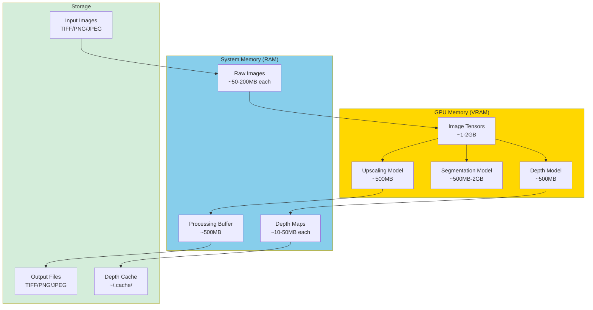

**Peak Memory by Configuration**:
- Minimal (no upscale): 2-3 GB VRAM, 2-3 GB RAM
- Standard (4x upscale): 4-5 GB VRAM, 3-4 GB RAM  
- High throughput (batch 4): 8-10 GB VRAM, 4-6 GB RAM
- Maximum quality (2048px, 4x): 12-16 GB VRAM, 6-8 GB RAM

---

## 10. Security Architecture

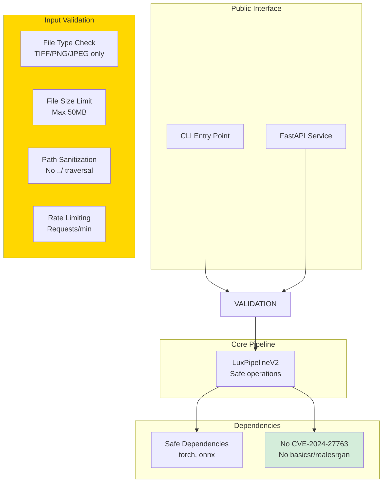

**Security Features**:
- ✅ Input validation (file type, size, path sanitization)
- ✅ Rate limiting (prevent abuse)
- ✅ CVE-2024-27763 mitigation (removed vulnerable dependencies)
- ✅ Safe upscaling backends (torch/onnx only)
- ✅ No arbitrary code execution risks

---

## 11. Deployment Architecture

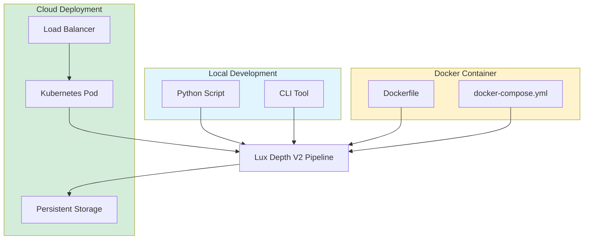

---

## 12. Performance Optimization Paths

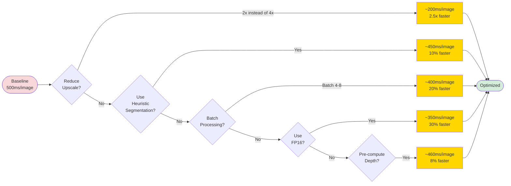

---

## 13. Key Design Decisions

### 13.1 Modular Architecture
- **Why**: Enables independent testing, easy swapping of backends (e.g., segmentation, upscaling)
- **Trade-off**: Slightly more complex initialization vs monolithic design

### 13.2 GPU-First Design
- **Why**: Modern depth/segmentation models require GPU for acceptable performance
- **Trade-off**: CPU fallback is ~10x slower but available

### 13.3 Preset System
- **Why**: Simplified UX for common use cases, reduces parameter overwhelm
- **Trade-off**: Less granular control unless overriding presets

### 13.4 Optional Depth Input
- **Why**: Allows pre-computed depth maps for faster iteration
- **Trade-off**: Users must manage depth map lifecycle separately

### 13.5 Safe Upscaling Only
- **Why**: CVE-2024-27763 security vulnerability in RealESRGAN/basicsr
- **Trade-off**: Removed one upscaling backend, but torch/onnx alternatives are safe and high-quality

---

## 14. Extension Points

Future enhancements can plug into these extension points:

1. **Custom Tone Mapping Operators**: Add to `torch_ops.py`
2. **New Material Types**: Extend `material_profiles.py`
3. **Additional Segmentation Backends**: Implement interface in `material_segmentation.py`
4. **Custom Upscaling Models**: Implement `Upscaler` interface in `upscaling.py`
5. **New Presets**: Add to `Preset` enum and `apply_preset()` in `config.py`
6. **Video Processing**: Add temporal smoothing to `pipeline.py`

---

## 15. References

- **Pipeline Implementation**: `lux_depth_v2/pipeline.py`
- **Configuration**: `lux_depth_v2/config.py`
- **Test Suite**: `lux_depth_v2/tests/`
- **Documentation**: `lux_depth_v2/README.md`, `lux_depth_v2/SECURITY.md`
- **RAG Analysis**: `DEPTH_PROCESSING_PATTERNS_RAG_REPORT.md`

---

**Document Version**: 2.0  
**Last Updated**: December 8, 2025  
**Maintainer**: Transformation Portal Team
