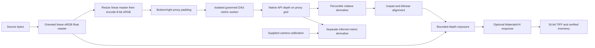
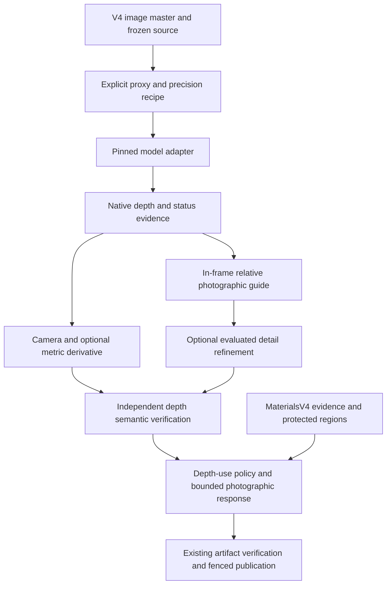

# Depth forensics and the LuxDepthV5 successor

**Audit date:** 2026-09-20

**Audited repository commit:** `3a0744c40ee932c1a27c5b072231ea401af9ca5d`

**Status:** Evidence-backed design recommendation; no runtime implementation,
model promotion, or production activation performed.

**Scope:** Still photography, preservation of photographic pixels, Apple Silicon
first. LuxDepthV5 is a proposed working name, not an existing interface.

## Decision

The successor should be **LuxDepthV5: a photographic pipeline with explicit depth
evidence, evaluated detail recovery, and reliability-aware editing**. Build it
additively on V4's execution, image-master, runtime, and publication machinery.
The central upgrade is the meaning and demonstrated usefulness of depth, rather
than merely selecting a larger model or writing a larger raster.

Keep the governed **DA3METRIC-LARGE** checkpoint as the initial control and
candidate foundation. First correct the depth-consumer defects, preserve sky and
image-support semantics, and evaluate explicit inference-resolution and precision
profiles. Then compare DA3MONO-LARGE for photographic relative depth and MoGe-2
for metric geometry. Use Depth Pro as a boundary-quality comparison only after
repairing its adapter and respecting the repository's existing research gate.
No alternative checkpoint has earned production selection from this investigation.

The architectural successor is determined; the winning model and production
profile remain an empirical selection. V3 remains the documented production
baseline. V4 remains an opt-in candidate and the immediate comparison baseline
for V5. Do not retire either entrypoint or reinterpret their cached artifacts.

## Evidence and method

The Desktop checkout and freshly fetched `origin/main` both resolved to the
audited commit. The pre-existing Desktop `AGENTS.md` modification was preserved.
This report is isolated in `/private/tmp/tp-depth-successor-forensic` on
`codex/depth-successor-forensic`. No product source was edited.

Three independent reviews covered artifact/consumer contracts, inference
backends, and quality evidence. The investigation combined current source,
deterministic adversarial probes, existing focused tests, retained native
artifacts, visual inspection, and current primary model sources. There were no
new model downloads, runtime installations, or fresh neural-network inference
runs in this audit.

Evidence labels:

- **Reproduced:** executable local probe demonstrates a behavior.
- **Source-proven:** current implementation establishes a behavior; occurrence or
  severity on real photographs may remain unmeasured.
- **Historical, rechecked:** retained outputs were inspected and rehashed now;
  their original runtime is not a fresh current-head execution.
- **Unmeasured:** no qualifying experiment establishes the claim.
- **Proposed:** successor requirement, not a current capability.

Private evidence, scripts, logs, numerical results, and the visual contact sheet
are retained under `/private/tmp/depth-forensic-20260920/`. Its `evidence-index.json`
records file hashes. Private photographic assets and their identities are not
included in this report's Git worktree.

## What V4 actually executes



| Surface | Current authority and limitation |
| --- | --- |
| [V4 lifecycle](../../src/transformation_portal/lux_depth_v4/lifecycle.py), lines 34–56, 77–90, 257–259 | Frozen request/plan; only `da3_metric` is admitted; default target size 518 |
| [Photographic ingest and proxy](../../src/transformation_portal/lux_depth_v4/photography.py), lines 104–263 | Preserves the master separately; model sees a downsampled, quantized sRGB proxy padded to multiples of 14 |
| [V4 worker](../../src/transformation_portal/lux_depth_v4/worker.py), lines 39–132 | Persistent governed model, offline strict identity, seed reset before inference; calls the DA3 API directly rather than the V3 normalized-result path |
| [Depth artifact](../../src/transformation_portal/core/depth_artifact.py), lines 47–150 | Immutable native depth, validity, optional meters/confidence; relative normalization remains a derivative |
| [Calibration adapter](../../src/transformation_portal/lux_depth_v4/companions.py), lines 289–334 | Converts supplied master-frame intrinsics to the proxy; meters require explicit calibration |
| [Pipeline](../../src/transformation_portal/lux_depth_v4/pipeline.py), lines 292–374 | Uses relative depth for photographic exposure; exports native and aligned products separately |
| [Completion verification](../../src/transformation_portal/lux_depth_v4/evidence.py), lines 115–237 | Checks inventory, bytes, source bindings, and selected descriptor semantics; integrity is separate from depth quality |
| [Evaluation harness](../../src/transformation_portal/lux_depth_v4/evaluation.py), lines 523–600 | Verifies paired receipts and compares timing; explicitly leaves photographic acceptance unestablished |

The locked checkpoint is `depth-anything/DA3METRIC-LARGE` at
`4010e39f3634a45bc60553321fb49fb760bd594e`. Governed DA3 source is
`95a2adea1a8180104bf51937409034bdec70a244`, matching the inspected local upstream
checkout. See [model lock](../../config/model_lock_manifest.yaml), lines 81–88,
and [runtime contract](../../config/da3_runtime_identity_contract.json).
This source comparison does not independently revalidate the installed runtime's
entire dependency closure.

### Correct properties to retain

V4 avoids several legacy errors: it preserves API depth as float32 instead of
consuming a display image; does not claim meters without supplied calibration;
does not invent model confidence; carries explicit proxy geometry; uses weighted
valid-sample remapping; and prevents invalid derivative pixels from receiving
depth-based finishing gain. It also retains immutable source-bound artifacts,
runtime verification, bounded subprocess execution, and fenced publication.

The inspected focal conversion is correct: independently resize `fx` and `fy`,
use their mean, then multiply native depth by that focal value divided by 300.
The pixel-center transform and bottom/right padding do not introduce a principal
point translation error. The V4 patch-divisible proxy also avoids a second resize
in the pinned upstream preprocessing. These were investigated and are **not**
findings. The conversion agrees with the [official DA3 FAQ](https://github.com/ByteDance-Seed/Depth-Anything-3#-faq).

## Findings that determine the successor

### F1 — Artificial padding can control real-image normalization

**P2; reproduced on the current V4 consumer path.**

The proxy adds bottom/right padding; `calibrated_depth()` includes finite padded
samples in validity. `DepthArtifact.relative_depth()` computes 1st/99th
percentiles over that mask. The pipeline removes padding only afterward.

With a 345×518 scene padded to 350×518, padding occupies 1.43% of the model grid.
Two probe inputs have identical in-frame depth. Changing only the padded values
changes the scene's normalized maximum from **1.0 to 0.11015**, and its finishing
gain range from **0.9585–1.1399 to 0.9952–1.0144**. A separately constructed probe
produced a maximum linear RGB difference of **0.03203**.

Evidence: [proxy creation](../../src/transformation_portal/lux_depth_v4/photography.py),
lines 255–263; [validity](../../src/transformation_portal/lux_depth_v4/companions.py),
lines 295–325; [percentiles](../../src/transformation_portal/core/depth_artifact.py),
lines 114–122; [consumer ordering](../../src/transformation_portal/lux_depth_v4/pipeline.py),
lines 314–318. Probes: `contracts/probe-results.json`, `quality/probes.json`.

**Observed-photo limit:** excluding padding on the retained real photograph
changed normalized in-frame values by at most **0.0001732**. The adversarial
extreme was not observed there. The defect is the unintended dependency, not an
established large error rate on photographs.

**Successor:** preserve all native samples, but add a separate in-frame support
mask. Relative statistics and photograph consumers must exclude padding. Test
invariance to arbitrary changes outside retained image support.

### F2 — Existing APEX depth scores cannot select a quality winner

**Release-blocking measurement gap; reproduced in the adjacent evaluator.**

The edge score is the clipped 95th percentile of raw gradient magnitude. Its
derived halo-risk score is one minus that value. Architectural plausibility is
a depth-spread/saturation statistic. None compares against correct geometry or
annotated boundaries.

| Synthetic input | Edge score, higher favored | Halo risk, lower favored | Architectural score |
| --- | ---: | ---: | ---: |
| Exact clean depth step | 0.0000 | 1.0000 | 0.8000 |
| Uniform random noise | 0.4802 | 0.5198 | 0.9032 |

Multiplying an otherwise identical ramp by 100 changes edge score from 0.00787
to 0.78740. These scores confound units, edge frequency, noise, and correctness.
They can be diagnostics under a declared representation; they cannot establish
boundary accuracy, architectural truth, or low halo error.

Evidence: [APEX helpers](../../src/transformation_portal/evals/apex_visual.py),
lines 1146–1171, and `quality/probes.json`. This is not a claim that V4's worker
uses these scores. V4's own evaluator correctly refuses automatic photographic
acceptance, but supplies no replacement depth-quality measurement.

**Successor:** ground-truth-aware metric and boundary evaluation, separate
ordinal/relative evaluation, and masked photographic edit evaluation. Include
tests ensuring random noise, constants, scale changes, invalid regions, and
incorrect boundaries cannot masquerade as improvements.

### F3 — Delivery resolution greatly exceeds inferred depth detail

**Source-proven limitation; illustrated by one historical photograph.**

The retained 4472×6708 image has 29,998,176 master pixels. Its depth was inferred
on **345×518 in-frame samples (178,710)**, padded to 350×518. Each in-frame model
sample therefore represents about **168 master pixels**, or approximately 13
master pixels along each axis. Aligned depth is bilinear interpolation.

The private contact sheet shows broad facade, foreground, and fountain layering,
while railing bars and fine chair/fountain structure are largely absent or
smeared in both retained V3 and V4 maps. This is qualitative inspection of one
scene, with different normalization recipes and no ground-truth distances;
it does not rank their accuracy. The real-photo source was an **8-bit-derived
TIFF**, distinct from the separate high-bit-depth synthetic ramp smoke.

Evidence: [proxy and alignment](../../src/transformation_portal/lux_depth_v4/photography.py),
lines 249–315; `quality/real_artifact_statistics.json` and
`quality/historical_depth_contact_sheet.png`.

**Successor:** expose native inference resolution separately from artifact
resolution. Compare 518, 1008, 1512, and 2016 longest-side profiles under the
existing worker limit before committing to tiling or a new model. These are
candidate experiment settings, not approved defaults or proven improvements.
Any refinement must demonstrate edge/detail improvement without texture copying,
halos, inconsistent planes, or invented metric precision.

### F4 — Finite sky values are not finite scene geometry

**Source-proven; a historical diagnostic sky region is consistent with it.**

The pinned upstream DA3 model detects sky and, when its population checks pass,
replaces it with the 99th percentile of non-sky depth. For large maps it samples
up to 100,000 non-sky values for that statistic. V4 retains only API depth,
discarding the sky output; finite sky samples become valid depth. With supplied
intrinsics, these can also appear as finite values in a metric derivative.

In a hand-selected clear-sky region of the retained photograph, every inspected
sample was valid and equal to **26.9931049 native units**. This is an approximate
diagnostic region, not an authoritative sky annotation or a distance measurement.

Evidence: pinned upstream `model/da3.py:155–177`,
`utils/io/output_processor.py:55–68`; [worker](../../src/transformation_portal/lux_depth_v4/worker.py),
lines 116–132; [calibration](../../src/transformation_portal/lux_depth_v4/companions.py),
lines 295–324; `quality/historical_integrity_and_padding.json`.

**Successor:** separate numeric validity from usable surface geometry. Preserve
model sky status, padding, unknown/unreliable regions, and upstream imputation
provenance. Permit explicitly declared photographic sky treatment; exclude
imputed sky from physical surface geometry and metric-quality scoring. Name the
retained native array accurately as API output, not pre-postprocessing logits.

### F5 — Float32 files do not establish float32 inference or calibrated confidence

**Source-proven policy inheritance; accuracy impact unmeasured.**

Pinned DA3 `api.py:125–129` chooses BF16 if its CUDA capability query supports it,
otherwise FP16, and enables autocast for the input device. The depth head disables
autocast separately (`model/da3.py:138–146`). V4's float32 serialization therefore
does not describe the complete mixed-precision computation. The plan has no
explicit precision selection. Seeding is present, but seeding alone is not proof
of kernel determinism or CPU/MPS numerical equivalence.

The locked metric head has one output channel and no contracted confidence
channel. V4's unavailable-confidence status is correct. Local smoothness,
two-model agreement, or a clipped model score must not be relabeled calibrated
probability of correct depth.

**Successor:** bind compute/accumulation/storage precision and actual device to
the inference recipe. Test repeated uncached execution and CPU/MPS tolerances.
Keep confidence unavailable until a typed score and calibration evaluation exist.
Disagreement can inform abstention, but does not itself establish accuracy.

### F6 — Invalid depth contaminates neighboring optional preview pixels

**P2; reproduced; previews are optional and correctly labeled nonphysical.**

The preview generator runs gradient/filter operations over zero-valued invalid
sentinels, then masks only the invalid output pixels. A 6×6 invalid hole on the
flat far region of a two-plane map changes **28 valid normal pixels, 604 roughness pixels, and 960 AO
pixels**. A flat neighbor changes from `[127,127,255]` to `[3,127,158]`.

Evidence: [preview adapter](../../src/transformation_portal/lux_depth_v4/photography.py),
lines 535–539; [legacy filters](../../src/transformation_portal/lux_depth_v3/pbr.py),
lines 149–150, 172–175, 217; `contracts/probe-results.json`. Existing tests
check the hole's replacement pixels but do not protect its valid neighborhood.

**Successor:** make filter support validity-aware or mark the affected support
neighborhood unknown. Physical normals require camera geometry and depth
semantics; relative-depth gradients do not establish measured normals,
roughness, or ambient occlusion.

### F7 — Cache identity is safe but unnecessarily couples artistic edits to inference

**Reproduced efficiency limitation; no stale-cache authorization demonstrated.**

Changing only finishing strength from 0.25 to 0.5 changes the depth-stage
identity despite identical proxy, depth-node configuration, source, runtime, and
model. Identity includes the entire plan fingerprint. Calibration and unrelated
batch/policy changes can likewise invalidate reusable inference.

Evidence: [identity](../../src/transformation_portal/core/execution_identity_v4.py),
lines 55–68; `contracts/probe-results.json`.

**Successor:** preserve complete plan authority, while introducing a separately
versioned inference-reuse key containing exactly the inference determinants.
Calibration, normalization, refinement, and response become independently bound
derivatives. Do not relax or cross-read old namespaces to obtain this reuse.

### F8 — Semantic validity and completion checks need a stronger next contract

**Source-proven boundary gaps, not evidence of corrupted live output.**

Uncalibrated validity accepts finite zeros, while calibrated validity additionally
requires positivity. A probe toggles 100 zero-valued samples between accepted and
invalid by supplying calibration. The governed model uses an exponential head,
so negative live output is not established; numerical zero underflow remains a
robustness consideration.

Completion verification rehashes artifacts and checks required inventory and
selected descriptors. It does not reconstruct the complete depth artifact or
numerically rederive relative/aligned/metric relationships. MaterialsV4 already
has independent numerical response verification, providing a useful pattern.

Evidence: [artifact](../../src/transformation_portal/core/depth_artifact.py),
lines 61–108; [calibration](../../src/transformation_portal/lux_depth_v4/companions.py),
lines 295–325; [evidence verification](../../src/transformation_portal/lux_depth_v4/evidence.py),
lines 161–237 and 431–505.

**Successor:** define native-domain validity independently of optional scale
calibration, and independently validate array headers, geometry, units, masks,
content identities, and derivative recipes before publishing completed depth
evidence. Numerical consistency still does not prove scene accuracy.

## Adjacent depth code that must not be inherited unchanged

These findings describe the forensic baseline. The subsequent
[adapter remediation](DEPTH_ADAPTER_REMEDIATION_2026-09-20.md) records the code
repairs, regression validation, and remaining acceptance limits.

These findings affect legacy/shared adapters; **they do not execute in the
current V4 native DA3 path**. Keep their remediation separately scoped.

| Priority | Reproduced behavior | Source and consequence |
| --- | --- | --- |
| P1 | Depth Pro validates a configured checkpoint but calls `create_model_and_transforms()` without that path | [Stage](../../src/transformation_portal/stage_graph/stages/depth_pro.py), lines 275–280. A custom authorized checkpoint can differ from the default actually loaded; receipt and inference can disagree. |
| P1/P2 | Ensemble scales relative output by an arbitrary `10.0` before metric fusion | [Ensemble](../../src/transformation_portal/depth/backends/ensemble.py), lines 701, 733–752. A 50 m reference and relative 0.5 become 50 m and 5 m; this is not recovered metric scale. Geometry restoration is also absent at stacking. |
| P2 | DA2 reads the display `depth` PIL image instead of float `predicted_depth` | [DA2 model](../../src/transformation_portal/depth/models/depth_anything_v2.py), lines 623–632, and [V3 inference](../../src/transformation_portal/lux_depth_v3/inference.py), lines 903–913. A 1,000-level float fixture collapses to 256 levels. |
| P2 | A callable manual DA2 model is mistaken for the pipeline adapter | [DA2 fallback and dispatch](../../src/transformation_portal/depth/models/depth_anything_v2.py), lines 397–414, 623. The model receives PIL rather than processor tensors and fails in the probe. |
| P2 | Depth Pro drops returned focal metadata and does not pass supplied focal input through this stage | [Stage](../../src/transformation_portal/stage_graph/stages/depth_pro.py), lines 168–172, 319–329; [backend consumer](../../src/transformation_portal/depth/backends/depth_pro.py), lines 467–468. Preserve estimated-versus-supplied focal provenance in a future adapter. |
| P2 | Direct uint16 inputs wrap on conversion to uint8 | [Depth Pro adapter](../../src/transformation_portal/depth/backends/depth_pro.py), lines 408–413; [DA2 adapter](../../src/transformation_portal/depth/backends/da2.py), lines 222–229. `[0,255,256,32768,65535]` becomes `[0,255,0,0,255]`. V4's controlled proxy avoids this path. |

Probes are in `backends/probe_backends.py` and `backends/probe_results.json`.
The existing backend tests pass while these probes reproduce defects: their
coverage does not yet assert the missing contracts. Separately,
[legacy confidence](../../src/transformation_portal/depth_intelligence/depth_estimator.py),
lines 248–269, is an inverse-local-variance heuristic, not an accuracy probability.

## Updated model comparison

Primary sources were checked on 2026-09-20. Published model claims describe their
authors' settings; none is a measured quality or speed result on this repository's
Apple Silicon host. Code license, weight license, repository policy, runtime
compatibility, and empirical quality are separate admission questions.

| Candidate | Reason to evaluate | Decision for the successor |
| --- | --- | --- |
| DA3METRIC-LARGE, currently pinned | Existing governed baseline; native depth and supplied-focal scale conversion | First control and initial implementation foundation. Evaluate resolution/precision/consumer changes independently. |
| DA3MONO-LARGE | Official relative monocular depth model, Apache-2.0 | First same-family photographic challenger. New exact checkpoint/runtime contract required; no metric claims from per-image normalization. [Official model family](https://github.com/ByteDance-Seed/Depth-Anything-3#-model-zoo) |
| MoGe-2, preferably explicit V2 normal-capable checkpoint | Joint metric geometry, fine detail, normals, and FOV support; the selected normal model card labels MIT | Metric-geometry challenger after a pinned V2 dependency/MPS feasibility spike. No native Mac performance claim is established here. [Paper](https://arxiv.org/abs/2507.02546), [model card](https://huggingface.co/Ruicheng/moge-2-vitl-normal) |
| Depth Pro | High-resolution boundary-oriented architecture; focal estimate and boundary evaluation definitions | Comparison lane after checkpoint/focal/precision adapter repairs. Local policy remains research-only. The current upstream code and weights reference Apple's custom license; reconcile exact pinned terms through governance before any policy change. [Reference implementation](https://github.com/apple-aiml-research/ml-depth-pro), [license](https://github.com/apple-aiml-research/ml-depth-pro/blob/main/LICENSE) |
| MoGe-3, released 2026-08-18 | New fine-detail sparse refinement | Exclude from the first Apple Silicon candidate: current upstream explicitly says macOS is unsupported because of FlexGEMM/Triton. Keep as a separately resourced comparator, not a drop-in V2 dependency update. [Current upstream](https://github.com/microsoft/MoGe#-installation) |
| HyDen / MetaDepth, 2026 | High-resolution dual-path encoder; metric/normal variants | Research comparator only: upstream FAIR Noncommercial Research license and unmeasured local runtime. [Official repository](https://github.com/facebookresearch/metadepth) |
| Marigold Depth v1.1 | Relative geometry comparator with documented MPS option and ensemble uncertainty output | Optional later comparison. Affine-invariant output is not meters; its effective resolution and extra inference passes do not by themselves solve fine-detail or cost requirements. [Model card](https://huggingface.co/prs-eth/marigold-depth-v1-1), [official inference settings](https://github.com/prs-eth/Marigold#%EF%B8%8F-inference-settings) |
| PatchFusion | Explicit learned global/local high-resolution fusion | Useful design/reference comparator after simpler resolution sweeps. Do not copy naive independently normalized tile stitching. [Official implementation](https://github.com/zhyever/PatchFusion) |

The refreshed DA3 `-1.1` checkpoints concern the listed any-view/nested models,
not a newly listed `DA3METRIC-LARGE-1.1`. The any-view Large/Giant and nested
checkpoints have different license restrictions. Do not infer an authorized
metric upgrade from the shared DA3 name. [Official model table](https://github.com/ByteDance-Seed/Depth-Anything-3#-model-zoo)

## Proposed successor design

### One depth-evidence contract, with separate meanings

Introduce a versioned successor to `tp.depth.artifact.v2`; schema allocation and
CLI naming belong to implementation. Do not mutate V4's historical meanings.

| Evidence component | Required meaning |
| --- | --- |
| Native prediction | Exact retained API/model representation, units, near/far direction, optical-axis depth versus ray distance, model and postprocessing recipe |
| Grid and support | Source/master/native/aligned grids, pixel-center transforms, crop/padding, orientation, and in-frame support independent of validity |
| Geometry status | Numeric-valid, usable-surface, sky/imputed, unknown, and out-of-support states; unavailable evidence must remain unavailable |
| Scale evidence | Relative, model-estimated metric scale, supplied-camera-calibrated scale, or independently measured reference; these are distinct statuses |
| Camera evidence | Supplied/estimated source, coordinate frame, distortion handling, intrinsics transformation, calibration receipt and applicability |
| Reliability | Typed raw scores, optional evaluated uncertainty, calibration identity, and explicit missing-data status; no invented probabilities |
| Derivative evidence | Normalization support and parameters, resampling/refinement recipe, validity propagation, input hashes, resource/precision identity |
| Use authorization | Explicit policy for photographic exposure, compositing, metric export, or physical geometry; a valid float alone authorizes none of these |

Do not force model-estimated metric outputs such as a future MoGe/Depth Pro
adapter into a field that falsely claims measured camera calibration. Conversely,
known intrinsics do not turn a monocular prediction into measured scene distance.

### Reuse V4 infrastructure; separate inference from response



Retain the designated core executor and publication authority from
[ADR-051](../architecture/ADR-051-execution-artifact-authority-designation.md).
There is no need for another scheduler, artifact store, or material engine.

The native-inference cache key must bind source/proxy content, model bytes,
runtime/source/dependency identities, preprocessing, inference options, compute
precision, device/backend, and seed/determinism policy. Bind camera inputs there
only if the model actually consumes them. Keep the full execution plan attached
to provenance, while calibration/refinement/finishing have their own identities.
Validate cache-hit semantic equivalence and failure paths; use a new namespace.

High-resolution refinement remains optional. Preserve a globally coherent depth
anchor; account for crop intrinsics; align any crop-relative estimates in their
correct representation; check overlap residuals and seams; retain the raw parent
map. An RGB edge or a Materials label alone is insufficient evidence of a depth
discontinuity. Protect glass, water, mirrors, sky, and ambiguous regions according
to explicit policy. An unsupported refinement must abstain and report its status.

### Measure the quality that matters

Freeze sources and scene groups before tuning. Separate properties/scenes across
tuning and held-out evaluation; RAW/JPEG/TIFF derivatives of one scene are not
independent samples. A proposed pilot is 60 independent scenes with at least 40
held out, covering interiors/exteriors, thin railings, foliage, flat walls,
stairs, sky, glass, water, mirrors, low light, HDR, and unusual framing. That
pilot size is a starting design, not a statistical guarantee.

Obtain actual reference evidence appropriate to each question: registered depth
or surveyed points for metric claims, annotated depth boundaries and ordinal
relationships for unsupported surfaces, and masked regions for photographic
review. Record reference uncertainty and occlusions; sensor holes, reflective
surfaces, and segmentation boundaries are not automatically depth truth.

| Gate | Measurement and acceptance rule |
| --- | --- |
| Contract correctness | Reject invalid schemas/units/transforms; padding invariance; invalid-support preservation; calibration-domain consistency; cache equivalence; exact checkpoint and precision receipts |
| Metric accuracy | AbsRel, RMSE in meters, delta thresholds, scale bias and errors at trusted surveyed points, on valid reference overlap; no scale fitting when reporting metric accuracy |
| Relative geometry | Ordinal pair accuracy and a separately labeled scale/affine-aligned score with the alignment domain and fitted parameters disclosed |
| Boundary/detail | Precision/recall/F1 at declared pixel tolerances, edge displacement and transition width, thin-object recall, plane residuals, texture-copy and halo errors; annotated ground truth required |
| Reliability | Error versus retained coverage, rejection behavior by scene category, risk/coverage curves, and calibration only where labeled evidence supports it |
| Photographic result | Blind paired full-frame and 100% crop review, depth-only edit masks/deltas, protected-region invariance, clipping/halos/color damage; keep Materials effects separately attributable |
| Native execution | Independent uncached cold/warm runs, cache miss/hit separation, cancellation/resource failures, FP32/mixed-precision comparisons, explicit CPU/MPS numerical tolerances |
| Cost and promotion | Per-profile p50/p95 time, peak parent+worker RSS, separately observed device memory where available, output size and energy only if measured; fixed host/runtime and independent repeats |

Predeclare noninferiority margins, budgets, critical-category vetoes and primary
metrics before the holdout run. A defensible selection requires a positive paired
boundary/detail improvement with uncertainty bounds, no unacceptable metric or
photographic regression, and the selected profile's cost budget. Use a Pareto
comparison when a quality tier intentionally costs more; do not hide that cost
behind cache hits. Twenty independent timing pairs is the existing harness
minimum, not proof that tail latency or all scene categories are adequately
sampled.

The current evaluation spec hard-codes `v3` and `v4`. Add a versioned evaluator
supporting named baseline/candidate identities and depth references; do not label
V5 as V4 or treat existing timing-only comparison output as depth acceptance.
Reuse receipt/integrity and paired-order mechanics while adding the missing
semantic and quality measurements.

## Delivery order and stop conditions

1. **Repair and characterize consumers.** Add padding-invariance and valid-filter
   neighborhood tests, consistent native-domain validity, and evaluator adversary
   tests under a new successor recipe identity. A V4 backport requires its own
   scoped bugfix, matching tests, recipe/cache invalidation and documented change;
   never relabel old artifacts. Keep legacy adapter repairs separate. Stop if
   execution or image fidelity regresses outside the explicitly changed behavior.
2. **Ship the opt-in depth-evidence contract.** Preserve status masks, camera and
   precision evidence, independently verified derivatives, and factored inference
   reuse. Exercise existing publication fences and MaterialsV4 compatibility.
3. **Run controlled profile/model comparisons.** Start with the governed DA3
   baseline's resolution and precision; then compare admitted DA3 Mono and MoGe-2
   adapters. Fix one experimental factor at a time. Missing Mac support, licenses,
   runtime closure, or depth references are explicit unavailable lanes.
4. **Add detail refinement only if evidence justifies it.** Compare against the
   best simple higher-resolution baseline. Reject seam/halo/texture-transfer or
   metric-scale regressions even if a sharpness statistic increases.
5. **Promote only after independent photographic and operational acceptance.**
   Preserve V3/V4 rollback, versioned artifacts, plan/cache isolation, and exact-head
   managed vertical-slice gates. No automatic model ensemble or default cutover.

## Validation performed and limits

### Current-head code and probes

The first command below produced **248 passes and 9 failures**. All nine failures
were macOS sandbox `sysctl` permission errors in the process monitor. Re-running
the two affected modules outside the sandbox produced **47 passes** (including
all nine previously failing cases). The other two independent suites produced
**81 passes** and **61 passes / 6 deselected**. Together they cover **399 distinct
selected tests**; repeated cases are counted once.

Run from `/Users/richardcheetham/Desktop/Transformation_Portal`:

```bash
PYTHONDONTWRITEBYTECODE=1 PYTHONPATH=src .venv/bin/python -m pytest tests/lux_depth_v4/test_backend.py tests/lux_depth_v4/test_bytecode.py tests/lux_depth_v4/test_core_imports.py tests/lux_depth_v4/test_evaluation.py tests/lux_depth_v4/test_lifecycle.py tests/lux_depth_v4/test_pipeline.py tests/lux_depth_v4/test_publication.py tests/lux_depth_v4/test_publication_admission.py tests/lux_depth_v4/test_raw.py tests/lux_depth_v4/test_runtime.py -q

PYTHONDONTWRITEBYTECODE=1 PYTHONPATH=src .venv/bin/python -m pytest tests/lux_depth_v4/test_backend.py tests/lux_depth_v4/test_raw.py -q

.venv/bin/pytest tests/core/test_v4_artifact_contracts.py tests/lux_depth_v4/test_photography.py tests/lux_depth_v4/test_companions.py -q --tb=short

PYTHONDONTWRITEBYTECODE=1 .venv/bin/pytest tests/unit/depth/test_depth_pro_stage.py tests/unit/depth/backends/test_depth_pro_backend.py tests/depth/backends/test_ensemble.py tests/depth/backends/test_da3_worker_determinism.py -q -m 'not ml'

PYTHONPATH=src .venv/bin/python /private/tmp/depth-forensic-20260920/contracts/probe_contracts.py
PYTHONPATH=src PYTHONDONTWRITEBYTECODE=1 .venv/bin/python /private/tmp/depth-forensic-20260920/backends/probe_backends.py
PYTHONPATH=src .venv/bin/python /private/tmp/depth-forensic-20260920/quality/probes.py
```

The additional quality-agent suite repeated 127 already-covered cases and passed;
it is not added to the distinct count. Logs and probe programs are retained in
the private evidence directory. Existing tests passing does not repair the
reproduced product or evaluator gaps. No canonical full `make ci` claim is made
for this report-only change.

### Historical native evidence rechecked now

Cold, cache-hit, and optional-companion synthetic-ramp outputs from the reviewed
V4 evidence directory were rehashed and accepted by the current completion
verifier: **10, 10, and 12 artifacts**, respectively. Their retained terminal
log identifies reviewed head `dbbec39d`; these are historical executions, not
fresh inference at the audited repository commit. This resolves the earlier
uncertainty about whether historical cache/optional checks completed.

The older real-photo output's eight declared artifact hashes and sizes also
match, but the **current verifier rejects it** because its inventory predates
the required `aligned-depth-valid.npy` artifact. This is a historical
contract-version incompatibility, not evidence of altered bytes. It is useful
for explicitly historical visual diagnosis, not current publication acceptance.

### Still unestablished

No paired held-out depth-ground-truth campaign, trustworthy comparative boundary
score, model-replacement result, current-head fresh native inference run, or
production-resolution performance acceptance was produced here. The measured
findings justify the proposed architecture and work order. They do not justify
calling any new model, profile, or LuxDepthV5 production-ready.
