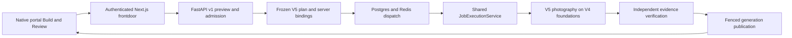

# HTTP and portal Lux successor forensic analysis

**Audit baseline:** `b00165992` (`origin/main`, 2026-09-21).

**Scope:** managed HTTP forwarding, portal Build/Operate/Review integration,
V5 preview/admission, and verified photographic publication. This is an
implementation audit of those paths, not a claim that the whole repository is
defect-free or that photographic production acceptance has passed.

## Successor decision

The supported successor is an incremental upgrade of the native operator portal
behind the existing Next.js managed frontdoor, using the shared fenced
`JobExecutionService` and **opt-in LuxDepthV5 photography**. V4 supplies the
preparation, runtime, image-master, and publication foundations and remains a
separate CLI comparison path. There is no managed `lux-depth-v4` job endpoint.
V3 remains the production default and rollback path.

[ADR-050](../decisions/ADR-050-portal-react-migration.md) remains proposed: no
comparative delivery, defect, or performance evidence in this audit justifies a
React rewrite. [ADR-051](../architecture/ADR-051-execution-artifact-authority-designation.md)
designates execution/artifact authority; it does not activate a replacement
executor. HTTP API, plan, photographic descriptor, and UI versions have separate
responsibilities and must not be collapsed into a cosmetic V6 name.

## Confirmed findings and corrections

| Finding at the audit baseline | Correction | Evidence boundary |
| --- | --- | --- |
| The HTTP API admitted V5, but the portal selector omitted it. Restored V5 state took archive branches and could emit archive arguments. | Dedicated opt-in V5 controls, closed photographic payload, preserved profile state, and explicit V5 workflow/capability copy. | UI behavior and emitted requests; does not establish native inference readiness. |
| Lux preview failure/refresh guards applied only to V3. V5 could be classified as an archive workflow. | V3 and V5 share fail-closed preview/readiness guards while keeping separate configuration contracts. | Blocked, failed, refreshed, and ready preview paths require browser coverage. |
| Concurrent preview triggers could duplicate identical HTTP requests; an older A request could overwrite a newer A after an A/B/A edit sequence. | Coalesce identical in-flight requests and gate completion on request generation as well as payload identity. Ignore stale metadata/preset responses. | Deterministic request-count/race tests; no unsupported wall-clock speed claim. |
| V5 configuration preview checked allowlists but deferred inexpensive missing-input/manifest and overlapping-output errors until preparation. It eagerly imported the photographic implementation for readiness queries. | Lightweight path prerequisites before expensive preparation where authorized; defer pipeline/material imports to their consumers. | Tenant authorization remains authoritative; preview is not permission to execute. |
| The managed proxy joined decoded path segments directly. Literal `#` and `?` in artifact names became URL syntax; dot/separator segments could alter the forwarded route. | Encode each validated segment, preserve the separate query, and reject ambiguous segments before upstream fetch. | Tests cover reserved characters, Unicode, nested files, literal percent encodings, traversal and control characters. Auth and CSRF remain required. |
| V5 delivered TIFF/NPY/JSON only, so a successful verified photograph had no browser-viewable image. | Plan-bound, bounded sRGB PNG review derivative included in declared inventory and semantic verification; primary precision outputs remain intact. | Presentation derivative is not the photographic master or a depth-quality measurement. |
| Once previews were added, generic Review pairing offered the TIFF against its own PNG derivative. | Exclude pairs with the same effective preview URL before hinted or heuristic ranking, preserving genuinely distinct comparisons. | Symmetric, hinted, and distinct-pair regressions plus hydrated Review coverage. |
| Managed V5 completion reconstructed semantic evidence twice before fenced staging. | Derive completion and publication from one independent semantic verification of the exact admitted plan; retain staging hash and fence checks. | Verification-count and tampering regressions establish removed duplicate work; native throughput remains unmeasured. |

Primary sources:

- [Portal source](../../web/secure-landing/portal-src/portal.template.js) and
  [photography request builder](../../web/secure-landing/portal-src/internal/photography.js).
- [Managed proxy](../../web/secure-landing/app/v1/%5B...path%5D/route.js) and
  [route regressions](../../web/secure-landing/tests/routes.test.mjs).
- [HTTP photography adapter](../../src/transformation_portal/portal/photography_jobs.py).
- [Shared execution service](../../src/transformation_portal/orchestrator/job_execution.py)
  and [photography adapter](../../src/transformation_portal/orchestrator/photography_adapter.py).
- [V5 pipeline](../../src/transformation_portal/lux_depth_v5/pipeline.py),
  [evidence verifier](../../src/transformation_portal/lux_depth_v5/evidence.py), and
  [publication](../../src/transformation_portal/lux_depth_v5/publication.py).

## Compatibility, security, and rollback

The route names, `/v1/*` response envelopes, managed authentication, actor/tenant
authority, SSE names, browser view query values, and existing selectors remain.
V5 does not inherit V3 presets, configuration metadata, staged uploads, runtime
paths, or cache overrides. Its optional MaterialsV4 and calibration inputs remain
pre-existing server-authorized manifests. No runtime or model download is added.

New preview-bearing plans declare their derivative recipe and output graph.
Legacy V5 plans keep their old artifact set and photographic descriptor;
upgraded readers continue to verify them. Matching API and worker code is needed
for new preview-bearing plans. Reverting requires draining those jobs first;
silently sending them to older workers is not a supported rollback. Operators can
disable managed V5 with `TP_LUX_V5_MANAGED_ENABLED=0` and continue on V3.

The browser preview has bounded dimensions and encoded size. It is declared
before execution, included in output reservation, hashed with the artifact
inventory, and independently reconstructed by the verifier. It does not add
mutable files to a published generation. Publication keeps exact admitted-byte
identity distinct from the semantic plan fingerprint.

Independent adversarial review closed two PNG-validation gaps: metadata is
checked after bounded pixel loading so trailing ICC/text chunks cannot bypass
the check, and the PNG header must declare the expected 8-bit RGB/RGBA format
before Pillow decoding. Otherwise a 16-bit PNG could be silently reduced to the
expected 8-bit samples. Rehashed pixel, format, metadata, plan-byte, semantic
fingerprint, and post-verification staging mutations have regression coverage.

## Performance evidence

The entry bundle decreased from 406,633 to 402,470 raw bytes and from 100,061 to
98,860 gzip bytes using the official Node 22.22.2 distribution. The existing
Overview module now owns capability-catalog rendering and is fetched only for
Overview; its gzip size increased from 90 to 5,125 bytes. Build and Review avoid
that module. This is an entry-loading tradeoff, not a reduction in the total
bytes of every visited surface. The unchanged entry budget remains 100,500 gzip
bytes; the formerly placeholder Overview module has an explicit 5,300-byte
budget. A delayed-module browser test verifies that the latest draft renders
after loading and that navigation fetches it only once.

Identical concurrent previews share one request. Superseded previews, including
those invalidated by a credential change, cannot publish stale state; bounded
body-read deadlines remain active. Managed publication now performs one
independent semantic reconstruction instead of two, while staging still checks
the verified bytes. These are measured size and work-count improvements; this
audit does not claim native model latency or end-to-end throughput gains.

## Validation and remaining acceptance

The following local commands passed in the isolated audit worktree. Python
commands use the existing repository-managed environment with `PYTHONPATH=src`.
Frontend commands use the official Node 22.22.2 distribution. Test counts
overlap between lanes and must not be summed as unique tests.

| Command | Result |
| --- | --- |
| `make test-lux-depth-v5-contract` | 799 passed across V4 foundations and V5 contracts |
| `make test-lux-depth-v5-managed-contract` | 252 passed, including publication-authority forgery and staging-mutation cases |
| `make test-orchestrator-contract` | 1,498 passed, 57 skipped; service-specific evidence is recorded separately below |
| `make test-orchestrator-http-contract` | 272 passed |
| `make test-portal-contract` | 399 passed |
| `make test-frontdoor-contract` | 328 Node tests and production Next.js build passed |
| `cd web/secure-landing && npm run test:coverage` | 328 passed; 51.84% lines, 43.48% branches, 48.54% functions; thresholds passed |
| `cd web/secure-landing && npm run lint:css` | Passed, 403 owned utilities and zero compatibility utilities |
| `make ci-quick` and `make test-fast` | Passed; fast lane 77 tests |
| `make validate-portal-browser` | Passed real local HTTP and browser workflow smoke, including V5 controls and blocked readiness |
| `make validate-frontdoor-browser` | Passed managed login, portal entry, and logout against real local servers |
| `make validate-portal-css-layer-parity` | Passed pinned Chrome 151.0.7922.34: 24 selectors, 39 properties, 353 runtime utility classes |
| `CI=1 PLAYWRIGHT_BASE_URL=http://127.0.0.1:3037 MOCK_FASTAPI_PORT=10037 make test-accessibility-browser` | Completed: 54 passed and one dark-390px layout case passed on retry; see limitation below |

The HTTP/hardening regression suite also passed 364 tests; the full managed
proxy suite passed 107 tests. Documentation catalog, structure, heading-link,
pre-commit, and worktree-cleanliness checks form the final closeout gates.

The final secret scan initially classified a catalog source checksum as an API
key. Its exception is restricted to the exact catalog file and complete source
path/64-character lowercase SHA-256 records; the catalog checker independently
verifies those hashes against source bytes. Ordinary credential fields, non-hash
values, and equivalent lines in other files remain outside the exception.

The full accessibility run reported a transient contrast failure on five
existing V3 selects in dark mode. The captured screenshot already showed pale
text, and the same test passed on retry. Eight isolated repetitions of the
unchanged affected case then passed with retries disabled. Suspected: inherited
text-color sampling while deferred panels become rendered. That mechanism is not proven;
the palette and accessibility assertions were not relaxed. This flaky result is
a verification limitation, so the audit does not characterize every check as
unconditionally green. All V5-specific browser cases passed.

Initial live-browser attempts failed because the macOS sandbox blocked Chrome,
and a shared virtualenv imported the Desktop checkout without an explicit
`PYTHONPATH=src`. The gates above passed after correcting those environment
conditions. The portal smoke also needed an explicit return to Build step 1
before its pre-existing archive auto-step assertion after exercising V5 step 3.
That was a stale harness assumption, not a changed navigation contract.

`make test-lux-depth-v5-managed-services` passed all 19 tests against real local
Postgres and Redis, using a dedicated migrated test database and unique Redis
namespaces. The inference subprocess is a controlled fixture. This exercises
admission, queue, worker, fenced publication, and artifact retrieval, but does not
prove native model quality or production distributed-host acceptance.

Hydrated browser fixtures exercise strict V5 payloads, blocked/failed/ready
previews, profile restoration, bounded layout, PNG decoding, and the preserved
TIFF download URL/filename. The synthetic browser download transport was
cancelled by Chromium, so this test asserts the download target rather than
claiming completion; actual byte retrieval is independently covered by the live
service lane. Screenshots are local audit evidence, not shipped product assets.

Production promotion still requires representative photographic comparisons,
native CPU/MPS and cold/warm cache measurements, optional-input acceptance,
distributed native-worker execution, and deployed managed-frontdoor evidence.
Controlled-worker fixtures, mocked browser responses, and local contract tests
must be identified as such. Target size 518 remains the default; 1008 is an
explicit comparison and has no new production acceptance from this audit.
