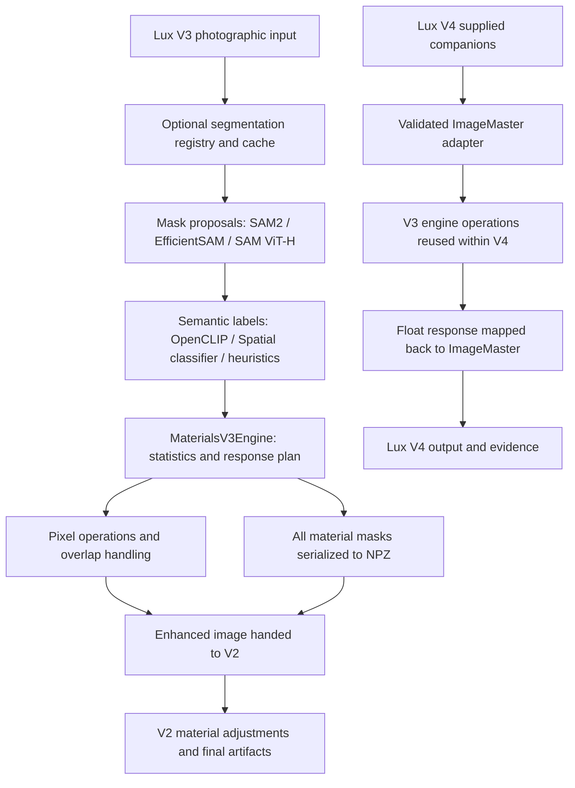
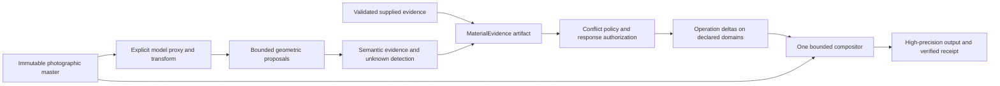

# MaterialsV3 forensic analysis and MaterialsV4 successor

**Audit date:** 2026-09-20 UTC / 2026-09-19 America/Los_Angeles

**Audited commit:** `211afde40d09046bb7dba4c3384b38850fd459db`

**Status:** Evidence-backed successor proposal; no runtime implementation or activation approval

**Scope:** Still photography, preservation of photographic pixels, Apple Silicon first

This report preserves the pre-implementation audit at the commit above. The
subsequent opt-in candidate and its validation are recorded separately in the
[implementation report](MATERIALS_V4_IMPLEMENTATION_2026-09-20.md).

## Decision

MaterialsV4 should be an opt-in, versioned **material-evidence and photographic-response library**, integrated with LuxDepthV4's existing execution and image-artifact contracts. Its essential advance is reliable edit authorization: establish what a region might represent, preserve uncertainty, and apply a bounded photographic adjustment only when the evidence and policy authorize it.

Retain SAM2 as a candidate geometric proposal/refinement backend. Replace the fragmented material vocabulary, confidence adapters, incomplete cache identity, and sequential mask-edit composition. Preserve LuxDepthV3 and its public contracts during migration. Keep Spatial PBR generation separate: photographic material labels do not establish measured physical reflectance.

The first deliverable should support trusted supplied masks with explicit provenance and a deterministic response engine. Automatic inference follows behind a separate acceptance gate, initially evaluated using the existing SHA-256-pinned SAM2.1 Hiera Large checkpoint plus one explicit semantic-classifier adapter. Existing CLIP implementations are comparison baselines; neither has earned calibrated automatic-edit authority. Model choice remains replaceable behind the evidence contract.

This selects an implementable architecture and migration sequence. It does **not** select a new production semantic checkpoint without a labeled photographic comparison.

## Evidence and method

The Desktop checkout and fetched `origin/main` both resolved to the audited commit. The pre-existing Desktop `AGENTS.md` edit was preserved. The report is isolated on `codex/materials-v4-forensic`; no product code was changed. Line references below refer to the audited commit, not historical documentation.

The investigation combined source/call-path review, relevant Git history, current contract tests, deterministic failure probes, an actual local SAM2 CPU smoke, canonical APEX asset verification, and primary-source review of model alternatives. Three independent reviews covered the engine, segmentation, and integration boundaries.

Evidence labels used here:

- **Reproduced:** a local executable probe or test demonstrated the stated behavior.
- **Source-proven:** the current implementation establishes the behavior, without a claim about real-photo frequency or perceptual severity.
- **Unmeasured:** an acceptance question remains; it is not a measured regression.
- **Proposed:** a V4 design or acceptance requirement, not a current capability.

Local raw evidence and runnable probes are retained outside Git at `/private/tmp/materials-v4-forensic-20260920/`. The evidence index records file hashes and commands. Private images and generated benchmark outputs are excluded from the report branch.

## What MaterialsV3 actually is



| Surface | Current responsibility | Important boundary |
| --- | --- | --- |
| `lux_depth_v3/materials_v3.py` | Statistics, response planning, pixel operations | Does not itself infer materials; accepts loosely structured dictionaries |
| `lux_depth_v3/segmentation/` | Optional proposals, labels, cache, fallback | Multiple confidence and backend identities coexist |
| `spatial_ai/segmentation/` | SAM2 geometry, optional separate classifier, tiling | Reusable geometric capabilities; distinct linear-image contract |
| `pixel_ops_registry.py` | Hand-authored photographic adjustments | Five material families have implemented operations; this is not inverse rendering |
| Lux V3 → V2 | Image and NPZ mask handoff | Mask arrays survive; original confidence and authorization decisions do not |
| `lux_depth_v4/photography.py` | Source-bound supplied masks on a high-precision master | Validates/filter inputs; delegates supported edits to the V3 engine |
| `stage_graph/stages/materials.py` | Generic heuristic material stage | Separate execution path, not the live Lux Materials authority |
| `spatial_ai/materials/` | PBR contracts, backends and heuristic maps | Separate objective and evidence requirements |

The V3 taxonomy contains nine names: sky, glass, water, foliage, wood, stone, metal, fabric, and stucco. Implemented V3 response families are sky, glass, water, foliage, and stone. Normal Lux SAM2 classification instead uses four OpenCLIP prompts: glass, water, foliage, and stone. These are three different capability inventories. [Taxonomy](../../src/transformation_portal/lux_depth_v3/materials_v3_taxonomy.py), [operations](../../src/transformation_portal/lux_depth_v3/pixel_ops_registry.py), [Lux classifier](../../src/transformation_portal/lux_depth_v3/segmentation/efficient_sam.py).

Defaults remain opt-in: `enable_materials_v3=False`, `enable_material_segmentation=False`, and backend `stub`. This limits default-path exposure; it does not resolve enabled-path defects. [Configuration](../../src/transformation_portal/lux_depth_v3/config.py), lines 408–476.

## Findings that determine the successor

### F1 — Material abstention is lost at the V2 boundary

**Priority: P1. Reproduced at the engine and public V2 stage boundary; full portal job not replayed.**

A 64×64 glass mask with semantic confidence `0.01` produces no V3 pixel operations and an unchanged V3 image. V3 still returns that mask. The orchestrator serializes arrays alone, then V2 receives them without the confidence or refusal decision. With global enhancement and clarity disabled, V2's material adjustment changes the uint16 image by **288 levels** in the probe.

Evidence: `materials_v3.py:177–186`; `orchestrator.py:5400–5445,5601–5647`; `stage_graph/stages/enhancement.py:495–523`. Probe: `integration/probe.py` and `integration/probe.json`.

**V4 consequence:** one response authorization governs every downstream material edit. A raw mask is evidence about a region, never permission to edit it. V4 must not invoke the legacy V2 material pass after composing its own response. Preserve V3 behavior until a separately scoped compatibility fix is implemented and tested.

### F2 — Geometric confidence can become semantic authority

**Priority: P1. Reproduced and source-proven.**

In the optional SAM2 metadata-label path, an absent `material_confidence` falls back to the segmentation score, then receives `material_classifier_probability_v1` and a calibration-version string. A glass-labeled proposal with no semantic score became semantic confidence **0.99** in the probe. Geometric mask quality cannot establish the material label.

Separately, OpenCLIP uses a fixed logit scale of 20 and labels the resulting ranking probability as calibrated. It records a top-two margin but does not use that margin for acceptance. No fitted calibration artifact or held-out calibration evaluation was identified in the inspected path. APEX checks the score-type name, not a calibration receipt. A supported score type with confidence `0.9` passes even when calibration evidence is absent.

The four-class `>0.2` proposal threshold cannot reject a finite winning softmax: its maximum is at least 0.25. **This alone does not prove an edit**, because later per-material thresholds reject 0.25. The all-negative similarity probe `[-0.1,-0.3,-0.3,-0.3]` produces a 0.9479 winning probability, illustrating why relative ranking is not an unknown-class detector; no real-image error rate is inferred from it.

Evidence: `segmentation/sam2.py:383–408`; `spatial_ai/segmentation/sam2_backend.py:933–938`; `segmentation/_cache.py:112–121`; `segmentation/efficient_sam.py:735–801`; `pixel_ops_decider.py:55–68`. Probes: `segmentation/probe-results.json`, `engine/probes.json`.

**V4 consequence:** type geometric quality, semantic scores, calibrated risk, and edit authority separately. Missing semantic evidence abstains. Calibration must bind actual model, preprocessing, vocabulary, data split, calibration method, and artifact bytes.

### F3 — Strict backend selection can still execute heuristics

**Priority: P1. Reproduced with controlled backend unavailability.**

With `strict_backend=True` and EfficientVIT unavailable, the adapter loads a placeholder and returns heuristic sky/water masks. Metadata reports `executed_backend="yunyangx/efficientvit-sam"`. Internal inference and CLIP failures have additional heuristic fallbacks. APEX rejects heuristic score types at its pixel-operation gate, which is a useful existing protection; other tiers and downstream V2 are distinct paths.

Evidence: `segmentation/efficient_sam.py:282–299,332–346,639–642,823–842`; `segmentation/registry.py:446–454`. Probe: `segmentation/probe-results.json`.

**V4 consequence:** freeze explicit fallback policy. Record the actual proposal model, actual semantic model, device, and algorithm per stage. Distinguish unavailable, no detections, low confidence, degraded execution, and successful inference. Strict execution cannot silently substitute algorithms. Missing dependencies are environment failures; misreporting the executed algorithm is product logic.

### F4 — The segmentation cache omits semantic identity

**Priority: P1. Source-proven, with controlled cache-replay demonstration.**

The cache binds image content, selected backend/device, the nominal `strict_backend` flag, and SAM parameters, but omits important semantic dependencies: EfficientSAM/OpenCLIP weight identities, vocabulary/prompts, calibration, runtime/source identity, and the actual algorithm/fallback outcome. Hidden internal fallbacks defeat the nominal strict request. A nonempty heuristic result is cacheable. Lookup occurs before backend loading; the probe replayed a result under strict mode while forcing backend construction to fail.

A cache hit without loading a model is not inherently invalid. The defect is that the key and receipt cannot establish that the cached result belongs to the current semantic execution. This segmentation cache is distinct from the governed depth-cache identities.

Evidence: `segmentation/_cache.py:280–318`; `segmentation/registry.py:347–371,431–443`; `segmentation/efficient_sam.py:174–187,227`. Probe: `segmentation/probe-results.json`.

**V4 consequence:** new cache namespace and complete stage identities. Reuse validated proposal artifacts independently from semantic classification and response rendering, so changing an exposure-strength policy need not rerun segmentation. Never authorize V4 output through a V3 cache key alone.

### F5 — Valid taxonomy members can crash response planning

**Priority: P1. Reproduced.**

Present wood, metal, fabric, stucco, or an unknown class reaches a return expression referencing `material_confidence`, although that variable is initialized only when operations are implemented. The result is `UnboundLocalError`, rather than a `no_implementation` decision.

Evidence: `pixel_ops_decider.py:108–113,146–173`; `materials_v3_response.py:152–162`. Probe: `engine/probes.json`. LuxDepthV4 filters unsupported classes before delegation (`photography.py:476–487`), so its existing adapter mitigates this particular crash.

**V4 consequence:** total, typed decisions over supported, unsupported, absent, and unknown labels. Classifier vocabulary must never exceed the planner's ability to decline safely.

### F6 — Pixel-change telemetry can be false

**Priority: P1. Reproduced.**

The executor's `before_padded` is a view of the output array. Writeback overwrites that view before delta statistics compare before and after. A water operation changed active pixels by mean absolute **0.035**, while both reported inside/outside delta values were **0.0**.

Evidence: `pixel_ops_executor.py:480,545,550–554`. Probe: `engine/probes.json`.

**V4 consequence:** retain an immutable baseline for measurements and independently verify final artifact deltas. Telemetry must distinguish authorized support, feather transition, protected regions, and truly unchanged pixels. Existing APEX image metrics remain valuable independent checks; operation self-report alone is insufficient.

### F7 — Ownership and editing decisions use different masks

**Priority: P2. Reproduced with synthetic masks.**

Overlap resolution happens before execution eligibility. A blocked, high-priority sky region can consume all support of an otherwise eligible water region. Coverage and bounding boxes can remain from the pre-overlap plan. In a probe, a water mask shrank from 4,096 pixels to one pixel but still received an operation despite a 500-pixel minimum. A separately supplied stale bounding box restricted edits to 16 of 2,304 active pixels. Equal-priority ownership depends on input mapping order.

Evidence: `pixel_ops_executor.py:342,389` and its overlap/bounding-box helpers. Probes: `engine/probes.json`, `engine/extra_probes.json`.

**V4 consequence:** validate evidence, resolve ambiguity under a documented policy, derive edit support, recompute support statistics, then authorize and compose. Abstention must not silently grant another contradictory class permission to edit. Ambiguous overlap defaults to protected/unchanged; priority can settle only an explicitly permitted conflict, with deterministic tie-breaking.

### F8 — The advertised delta ceiling is not the measured output ceiling

**Priority: P2. Reproduced numerically; perceptual severity unmeasured.**

The low-texture guard weights a delta already affected by a soft mask. The stock water operation on a uniform soft mask produced output p99 absolute delta **0.04845** under a configured **0.04** ceiling, while the guard applied no scaling. A stronger custom operation also demonstrates the mechanism, but the stock-operation reproduction is the relevant finding.

Evidence: `pixel_ops_executor.py:514–527`; config's p99 contract at `config.py:449–453`. Probe: `engine/builtin_ceiling_probe.json`.

**V4 consequence:** define the measurement domain and enforce limits on the final composed delta once. A p99 limit is not a maximum-pixel bound; report and test those separately. Preserve explicit transition support and protected-region exclusions.

### F9 — Semantic coverage and region representation are inconsistent

**Priority: P2. Source-proven and mapping probes.**

Normal Lux SAM2 leaves Spatial material classification disabled and inherits the four-prompt OpenCLIP route. Ten of the separate Spatial classifier's 24 default labels have no canonical mapping. Substring mapping mislabels examples such as `seaweed` and `windowless painted wall`. Normal CLIP sees padded bounding-box crops without masking; two different regions sharing a box therefore supply the same semantic input. Region scores are collapsed into per-material aggregates before editing.

Evidence: `segmentation/registry.py:164–183`; `segmentation/sam2.py:63–87,95,153–190,395–418`; `segmentation/efficient_sam.py:654–660,693–763`; `spatial_ai/segmentation/material_classifier.py:50–75`.

**V4 consequence:** one versioned taxonomy and exact alias table, per-region evidence until composition, explicit unknown/mixed labels, and evaluated mask-aware plus contextual classification. Distinguish photographic scene regions such as sky/foliage from physical surface material classes. Transparent glass and what is seen through it require an ambiguity policy, not an unquestioned priority stack.

### F10 — Refinement declarations do not establish refinement execution

**Priority: P2. Source-proven and policy probes.**

`refinement_strategy` is echoed into plan metadata, while the refinement decider hard-codes canary membership. `none`, `all`, and `canary` produced the same refinement decision in the probe. `should_refine_edges` has no execution consumer in the inspected source. The engine's `edge_conf` remains a placeholder; `mean_conf` is a mean over the full mask canvas and therefore conflates coverage with confidence when semantic evidence is missing.

Evidence: `materials_v3_response.py:74–117,138`; `materials_v3.py:99–109`. Probe: `engine/probes.json`.

**V4 consequence:** planned, attempted, applied, and unavailable refinement are different states. Only expose an actionable refinement option once its execution and evidence are implemented. Coverage, semantic confidence, and boundary quality require separate quantities.

### F11 — Photography encoding and resource claims need explicit contracts

**Priority: P2. Source-proven; limited synthetic memory measurement.**

The Lux SAM2 adapter divides uint8 samples by 255 and declares linear gamma=1.0; that operation alone does not linearize encoded RGB. EfficientSAM forces proposal generation to CPU for an MPS request while CLIP can remain on MPS. The single reported device cannot describe this hybrid execution.

Both semantic classifiers can batch all proposals without a resource bound. V3 full-frame pixel processing also allocates full-image scratch arrays. One-sky synthetic probes traced about **25.17 MB at 512²** and **100.67 MB at 1024²**, excluding input allocations. Approximately 96 bytes/pixel in that probe would extrapolate to 2.88 GB at 30 MP; that is an extrapolation, not a measured production peak. Gradients were float64. Tiled SAM2 geometry does not bound downstream classification or composition memory.

Evidence: `segmentation/sam2.py:312–327`; `spatial_ai/segmentation/contracts.py:24–32,64–69`; `segmentation/efficient_sam.py:430–441,709–722`; `materials_v3_response.py:58–71`. Probe: `engine/extra_probes.json`.

**V4 consequence:** preserve the high-precision master, explicitly encode model proxies, bind every geometric/color transform, bound proposal counts and classifier microbatches, and process output tiles with mathematically sufficient halos. Native MPS is a separate measured acceptance lane.

### F12 — Adjacent implementations cannot be assumed to supply missing capabilities

**Priority: P2. Source-proven, with a generic-stage probe.**

The generic stage can accept backend `onnx` yet execute its heuristic path while reporting `onnx`. Its wood heuristic compares skimage's normalized hue with degree-like values (`>10`, `<40`), yielding no wood on the probe. This is a separate path and is not evidence that canonical Lux uses that heuristic. Spatial PBR's named neural choices currently resolve to heuristics: NVDIFFREC/MaterialGAN have input-contract mismatches, and PBRFusion lacks integration/runtime; strict mode rejects those fallbacks. These paths do not complete MaterialsV3's semantic or photographic authority.

Evidence: `stage_graph/stages/materials.py`; `spatial_ai/materials/material_backend.py:56–138,306–316`; associated `contracts.py` and `pbr_generator.py`. Probe: `integration/probe.json`.

**V4 consequence:** use explicit adapters into one material-evidence contract. Do not merge execution systems or PBR objectives merely because modules share the word “materials.”

### F13 — Operation names overstate their spatial and physical meaning

**Priority: P2. Source-proven; photographic suitability unmeasured.**

`edge_contrast` changes contrast about 0.5; stone `microcontrast` does not extract a spatial frequency band; water reflection enhancement is brightness/contrast; foliage enhancement increases the green channel. Sky smoothing blends toward the region-wide mean, and its temperature operation applies a red/blue shift. The engine accepts a `depth_map` argument without using it. These can be useful aesthetic adjustments, but their names do not prove material understanding, geometric awareness, or physical correction.

Evidence: `pixel_ops_registry.py:80–90,110–124,145–162,183–202,277–296,319–340`; `materials_v3.py:123–185`.

**V4 consequence:** give operations precise measurable behavior and explicit photographic intent. A detected sky or foliage class should not by itself authorize an arbitrary color cast. Introduce actual local-detail or boundary-aware filters only with native-resolution quality evidence; retain legacy gains as named compatibility operations when parity is required.

## Strengths to retain

- Opt-in rollout, stable Lux V3 CLI/preset contracts, explicit APEX blockers, and reasons for blocked pixel operations.
- SAM2 checkpoint hashing, geometric contracts, optional backends, existing tiling and mask utilities. Reuse these selectively; they do not establish semantic accuracy.
- ROI-based operation intent, uint16/float paths, feather support, and low-texture guards, after repairing their measurement/composition defects.
- LuxDepthV4's `ImageMaster`, full-resolution canonical coordinates, immutable source binding, validated companion receipts, atomic publication, and execution evidence.
- Existing APEX asset/metric infrastructure and Lux V4 paired-run evaluation infrastructure. Avoid a competing performance authority or standalone executor.

LuxDepthV4 currently identifies supplied data honestly as `caller_supplied_mask_and_confidence` and `segmentation_inferred=False`. It does not assign a calibration score type. Its standard-tier V3 delegation is a trusted-supplied-input path, not calibrated automatic inference. Preserve this distinction. [Adapter](../../src/transformation_portal/lux_depth_v4/photography.py), lines 414–525; [companion contract](../reference/LUX_DEPTH_V4.md#optional-calibration-and-materials).

## MaterialsV4 design

### Public boundaries and ownership

Create a focused `src/transformation_portal/materials_v4/` package. The proposed responsibility split is contracts/taxonomy, evidence production, policy, response composition, artifacts, and Lux adapters. Keep this a library and stage implementation under existing execution authority, not a new job queue, generic DAG runtime, artifact manager, or package-wide version migration.

Suggested public operations are `prepare_materials`, `infer_materials`, `plan_response`, and `apply_response`. These are proposed interfaces, not currently runnable APIs. Preparation freezes request semantics and allowed models before inference. The existing executor owns sequencing, cancellation, output admission, and final publication.



### Proposed contracts

Names below are proposed, independently versioned contracts. The “V4” product/module name does not require all schema versions to be four.

| Contract | Required semantics |
| --- | --- |
| `MaterialRequest` | Source digest; canonical master descriptor; supplied/inferred evidence mode; taxonomy/policy IDs; model/runtime identities; exact proxy transforms; declared fallback and resource limits |
| `MaterialEvidence` / `tp.materials.evidence.v1` | Source and geometry binding; immutable per-region masks or references; region IDs; physical/scene label namespaces; unknown/mixed states; separate geometric and semantic scores; actual backend and device; status/reason |
| `CalibrationReceipt` | Model, tokenizer/preprocessing, prompt/vocabulary and dataset-split digests; proposal/refinement/selection, crop/mask representation, resize/color transforms and aggregation identities; calibration method/artifact; supported domain/classes; held-out reliability/risk metrics; explicit absent state |
| `ResponsePlan` / `tp.materials.response_plan.v1` | Evidence digest; resolved conflict/protection support; post-resolution coverage; operation and policy versions; declared working color domain; parameters; allowable transition support; edit budgets; all abstention reasons |
| `ResponseReceipt` / `tp.materials.response_receipt.v1` | Plan/evidence/input/output digests; actual operations; independent before/after statistics; changed/unchanged/protected support; clipping and resource telemetry; terminal status |

Artifact headers must validate dimensions, coordinate system, dtype, finite range, allowed names, aggregate bytes, and bounded counts before allocation. Reject stale source identities, changed files, symlink/path escapes, malformed arrays, contradictory receipts, and unsupported schema versions. Use canonical JSON plus validated numeric artifacts, never executable deserialization. Check actual bytes at execution and cache reuse.

Keep timing and variable resource measurements outside deterministic authorization and cache keys. A run receipt may reference those observations, but elapsed time must not alter the prepared response/evidence identity. Changing region construction or score aggregation invalidates calibration applicability even when classifier weights are unchanged.

A numeric score or a self-declared calibration string cannot promote external data into machine-calibrated authority. Supplied masks have an explicit caller-asserted or reviewed provenance class; inferred masks require the model/calibration path. An artifact hash proves identity, not truth or issuer trust.

### Semantic and response policy

1. Preserve each region's geometry, semantic evidence, and uncertainty before unioning material classes. Use exact taxonomy mappings and an unknown state.
2. Reject malformed data. Mark unavailable inference separately from a successful empty result. Keep planned fallback opt-in and observable.
3. Establish evidence eligibility and protected ambiguity. A low-confidence overlapping mask must neither silently starve valid regions nor silently authorize edits through a competing interpretation. Default uncertain overlap to unchanged.
4. Resolve approved ownership with a deterministic, order-independent policy. Recompute coverage, bounding boxes, boundary support, and confidence summaries from final support.
5. Authorize operations from that final evidence. Unsupported classes remain valid observations with no edit. Start with the five existing response families; wood, metal, fabric, stucco, painted surfaces, and subtypes need separately validated operation policies before activation.
6. Generate operation deltas from a declared immutable baseline or an explicitly declared intra-region chain. Compose material contributions once under total-alpha and delta limits. Prevent repeated independent feathering from recreating double application.
7. Apply bounds in the documented measurement/color domain to the final composed delta. Preserve original pixels exactly outside authorized support plus explicit transition support; protected pixels remain exact. Preserve alpha and source metadata.
8. Verify output and emit a terminal receipt. Abstention may be a correct result; never force edits to satisfy an operation-count gate. If the product requires a material-enhanced deliverable, report that requirement as unmet separately.

This changes the meaning of response success in a new version. Existing V3 APEX no-op policy must remain unchanged until an explicit versioned integration adopts the new semantics.

### Color, precision, and resource design

Use LuxDepthV4's master and transform types as the photographic boundary. A bounded encoded RGB inference proxy is acceptable when its conversion, resize, crop, orientation, and inverse mapping are explicit and identity-bound. The proxy never replaces the photographic master. Define operations as linear-domain or encoded-domain transforms individually; legacy encoded operations require a named compatibility adapter, not a blanket assertion that all operations are physically linear. Encoded or perceptual deltas cannot be summed directly into linear samples: each contribution must use a validated domain-conversion/composition rule, and final bounds are checked after that conversion.

Preserve HDR headroom and exact untouched samples. Quantize only at the final declared output boundary. Make feather radius, boundary uncertainty, and filter support resolution-aware. Use tile halos derived from each operation's support; nonlocal operations require a documented global pass or remain unsupported by the tiled path. Prove tiled-versus-full equivalence within a declared numeric tolerance before enabling it.

Resource policy includes maximum decoded pixels, aggregate mask bytes, proposals, classifier microbatch, tile size/halo, and concurrent model loads. Values must be selected from measured hardware budgets. An explicit overflow result is safer than a hidden quality change. Record proposal and classifier devices separately; CPU fallback cannot masquerade as MPS.

### Cache and execution identities

Use the existing core execution-plan/identity machinery, extending it through reviewed version handling if its closed schemas need new semantics. Do not put executable authority into arbitrary metadata.

Separate cache stages:

- **Proposal identity:** source/proxy transforms, checkpoint bytes, proposal configuration, source/runtime dependencies, actual execution policy.
- **Semantic identity:** proposal artifact digest, crop/mask representation, classifier/tokenizer bytes, vocabulary/prompts, calibration and unknown policy.
- **Response identity:** evidence digest, resolved response policy, operation implementation/version, color transforms, parameters, composition/tiling specification.

The frozen plan specifies allowed execution before runtime work. Receipts bind actual artifacts and outcomes afterward. Content-addressed outputs are admitted only after revalidation; valid cached evidence may avoid model initialization without weakening those checks.

### Lux and Spatial integration

Keep `tp.lux.companions.v1` and the current Lux V4 default graph stable. First integrate V4 with supplied evidence behind an explicit selection and an adapter. A richer inferred-material receipt needs a deliberately versioned companion/evidence interface; do not silently add mandatory semantics to existing v1 records.

Retain the old MaterialsV3 adapter for comparison/rollback. New V4 rendering must bypass V2's independent material-adjustment path. Changes to a closed execution plan, CLI, preview normalization, schema, run-card or artifact envelope require matching version/tests/docs in the same implementation PR.

Spatial PBR can later consume material evidence through an adapter, with explicit `estimated`/`heuristic` physical-map provenance. It must not infer that an accepted photographic response verifies roughness, normals, BRDF, or metric scene truth. Video, generative material replacement, inverse rendering, and automatic relighting are separate future scopes.

## Model decision

| Candidate | Decision | Evidence/reason |
| --- | --- | --- |
| Existing pinned SAM2.1 Hiera Large | Initial geometric reference candidate | Repository checkpoint-integrity and adapter infrastructure exist; one real CPU prompted smoke passed. Full-photo MPS and automatic-mode budgets remain unmeasured here |
| Current EfficientSAM/OpenCLIP path | V3 comparison baseline | Hidden fallback, incomplete identity, vocabulary and semantic-authority gaps prevent direct promotion |
| A single explicit CLIP-family semantic adapter | Initial semantic experiment | Reuse available infrastructure, unify taxonomy/preprocessing, retain raw scores; no automatic edits until domain calibration and held-out tests pass |
| A supervised material segmentation head | Challenger if calibrated CLIP cannot meet risk/coverage targets | Evaluate dense material labels and boundaries on the same corpus; training data rights and runtime portability must be verified |
| SAM3 / SAM3.1 | Optional research challenger | Official SAM3 supports concept prompts, but its documented environment is CUDA-oriented and its license differs. Upstream concept scores are not repository-specific material calibration |
| MatSpectNet | Research comparator | Targets material segmentation using reconstructed spectral features; research results do not establish this repository's photographic/MPS runtime suitability |

SAM2's official checkpoint/code licensing is documented in its [repository](https://github.com/facebookresearch/sam2#license). The [SAM3 repository](https://github.com/facebookresearch/sam3#installation) documents Python 3.12+, PyTorch 2.7+, and a CUDA GPU requirement; [SAM3.1 release notes](https://github.com/facebookresearch/sam3/blob/main/RELEASE_SAM3p1.md) emphasize multi-object video tracking. This supports keeping it out of the first Apple Silicon implementation; it is not proof that every possible MPS port is impossible. Review the actual [SAM license](https://github.com/facebookresearch/sam3/blob/main/LICENSE) before adopting it; no legal compatibility conclusion is made here.

The [CLIP model card](https://github.com/openai/CLIP/blob/main/model-card.md) documents sensitivity to category design. [MatSpectNet's paper](https://openaccess.thecvf.com/content/WACV2025/html/Heng_MatSpectNet_Material_Segmentation_Network_with_Domain-Aware_and_Physically-Constrained_Hyperspectral_Reconstruction_WACV_2025_paper.html) and [official implementation](https://github.com/heng-yuwen/MatSpectNet) establish a material-specific research option, not a ready local replacement. These are targeted comparisons, not a claim of an exhaustive state-of-the-art survey. Upstream pages were checked during this audit and may change after this date.

## Acceptance evidence and rollout

### Existing evidence available now

The current canonical APEX manifest contains three externally stored, 16-bit photographic references. All three passed the repository asset audit with zero missing or noncanonical assets. This establishes asset integrity and scoring eligibility, not material ground truth, semantic coverage, or a completed quality comparison.

The manifest names expected materials and risk zones, but does not supply per-region calibrated labels or completed manual quality scores. Existing APEX metrics include independent image-delta and seam diagnostics; the candidate mask path unions classes, so it cannot alone prove per-class semantic IoU or confusion. [Evalset](../../evalsets/apex_real_estate_v1/evalset.json), [metric implementation](../../src/transformation_portal/evals/apex_metrics.py), [mask union](../../src/transformation_portal/evals/apex_visual.py), lines 764–820.

### Required gates

| Gate | Evidence required before advancement |
| --- | --- |
| G0: Contract and failure correctness | All reproduced F1–F8 scenarios have targeted tests; no geometry-to-semantic score conversion; malformed/unknown inputs decline or fail explicitly; output telemetry agrees with independent differences |
| G1: Supplied-mask photographic response | High-bit-depth, HDR-headroom and alpha preservation; exact unchanged/protected pixels; post-conflict minimum support; deterministic composition; no seam regression; V2 abstention-bypass test |
| G2: Semantic evidence | Annotated real photographs separated by property/scene into training, calibration, candidate selection and sealed final evaluation; per-class IoU/boundary metrics; confusion/unknown errors; calibration and risk-versus-coverage with confidence intervals |
| G3: Photographic quality | Blinded paired original/V3/V4 review at native resolution; independent color, clipping, seam, halo, bleed and texture measurements; inspect glass/reflections, water/sky boundaries, foliage and low-texture walls; demonstrate benefit without relying on global averages |
| G4: Operational acceptance | Exact model/runtime/input receipts; cold/warm/cache-hit/cache-miss runs; native MPS and declared CPU fallback; full-resolution RSS/device memory; cancellation, unavailable model, resource exhaustion, corrupt artifacts, cache mutation and optional-input failures |
| G5: Cutover | Opt-in canary meets G0–G4; public schema/CLI/preview/artifact contracts pass; exact-head review and terminal upstream checks; rollback to retained V3/legacy adapter demonstrated |

Use existing paired-evaluation machinery where applicable: its requirement is at least 20 independent complete-batch pairs, not repeated crops of one scene. Extend receipts deliberately if Materials-specific metrics are needed. [Lux V4 evaluation](../../src/transformation_portal/lux_depth_v4/evaluation.py), including `MIN_REPEATS` and `validate_spec`.

Proposed invariant thresholds can be exact now: zero unauthorized/protected-pixel edits, zero hidden fallback, no NaN/Inf, correct schema/shape/source binding, and deterministic results within a named runtime contract. Cross-device bitwise equivalence is not promised without proof. Per-class risk, quality noninferiority, latency and memory limits must be preregistered after a V3 baseline and deployment-hardware budget; inventing production numbers from unit tests would be misleading. Freeze model, prompts, thresholds and policy before opening the sealed final property/scene holdout; do not reuse it to select successive challengers. Poor coverage must not be hidden by perfect precision on a tiny abstaining subset, and calibration alone cannot repair inadequate semantic discrimination.

### Reviewable implementation sequence

1. **Stabilize the V3 reference in narrow PRs:** unsupported-class crash; correct delta telemetry; preserve refusal decisions at V2; distinguish fallback identity; test missing semantic confidence. Keep contract-sensitive changes explicit and separate. Failing regression probes must turn green, not be deleted.
2. **Define V4 evidence and pure policy:** typed contracts, taxonomy/unknown behavior, calibration receipt, deterministic conflict/protection decisions, artifacts and cache invalidation. No model substitution in this step.
3. **Ship an opt-in supplied-evidence vertical slice:** immutable photographic master, deltas plus one compositor, independent receipt verification, Lux V4 adapter, rollback and G1 evidence. This can be useful before automatic material recognition is accepted.
4. **Establish semantic inference:** pinned SAM2 geometric reference plus one explicit semantic adapter, bounded resources, actual-runtime provenance, calibration/held-out corpus, no heuristic promotion. Benchmark alternative models only behind identical contracts.
5. **Prove performance and quality, then consider default migration:** native hardware and full-resolution paired evaluation, approved thresholds, canary evidence and exact-head release review. A source/test green result alone cannot activate this step.

The task completed here is analysis and successor definition. These implementation steps are proposed work, not changes already made.

## Validation performed

Commands below were run from the audited Desktop checkout with the repository `.venv`; logs/JUnit reports are in the local evidence root. Results are per run and overlap; do not sum them as unique test coverage.

| Validation | Result | What it proves |
| --- | --- | --- |
| Materials, classifier integration, stage normalization, Lux V4 companions/photography | **345 passed, 6 skipped**, 16.41s | Selected contracts and current test expectations |
| Adjacent Spatial segmentation/materials and preset tests, excluding ML/slow/benchmark | **237 passed, 110 deselected**, 15.04s | Adjacent lightweight compatibility/contracts |
| Real SAM2 CPU prompted segmentation, 512×512 synthetic input, pinned Large checkpoint | **1 passed**, 8.70s; five measured repeats mean **0.934s**, p95 **0.943s**, three masks | Actual local geometric inference; not semantic accuracy or automatic/full-photo/MPS performance |
| Canonical APEX asset audit | **Passed**, 3/3 eligible | External photographic reference integrity |
| Deterministic forensic probes | **Reproduced product defects above** | Passing suites leave real blind spots; synthetic probes do not measure prevalence |

The six skips were MPS unavailable, CUDA unavailable, and four classifier tests explicitly skipped by the suite for mocking limitations. The process reported macOS arm64, Python 3.12.13, torch 2.13.0, torchvision 0.28.0, NumPy 2.4.6, SciPy 1.17.1, SAM2 1.1.0, EfficientSAM 1.0.0, and open-clip-torch 3.3.0. MPS was built but unavailable to this process. That is an environment limitation for this run, not a finding that the hardware or product lacks MPS support.

For reproduction, run from your repository root and set `APEX_ASSET_ROOT` to
your private canonical asset directory. Set `EVIDENCE_DIR` to a fresh directory
outside the repository. The following commands express the recorded checks
without depending on the original machine's checkout path:

```bash
export APEX_ASSET_ROOT=/absolute/path/to/apex-assets
export EVIDENCE_DIR=/absolute/path/to/materials-forensic-evidence
PYTHONDONTWRITEBYTECODE=1 .venv/bin/python -m pytest \
  tests/materials \
  tests/spatial_ai/segmentation/test_material_classifier.py \
  tests/spatial_ai/segmentation/test_sam2_material_integration.py \
  tests/stage_graph/test_materials_stage_output_normalization.py \
  tests/lux_depth_v4/test_companions.py \
  tests/lux_depth_v4/test_photography.py -q -ra

PYTHONDONTWRITEBYTECODE=1 .venv/bin/python -m pytest \
  tests/spatial_ai/segmentation tests/spatial_ai/materials \
  tests/spatial_ai/test_materials.py \
  tests/lux_depth_v3/test_segmentation_package_exports.py \
  tests/validation/test_validate_materials_preset_schema.py \
  -q -ra -m 'not slow and not benchmark and not ml'

PYTHONDONTWRITEBYTECODE=1 TP_RUN_BENCHMARKS=1 \
  TP_SAM2_BENCHMARK_DEVICE=cpu HF_HUB_OFFLINE=1 TRANSFORMERS_OFFLINE=1 \
  .venv/bin/python -m pytest \
  tests/spatial_ai/segmentation/test_sam2_backend_performance.py::TestSAM2PromptedModePerformance::test_points_mode_latency \
  -v -s

PYTHONDONTWRITEBYTECODE=1 .venv/bin/python tools/audit_apex_assets.py \
  --evalset evalsets/apex_real_estate_v1/evalset.json \
  --asset-root "$APEX_ASSET_ROOT" \
  --require-canonical on \
  --output-dir "$EVIDENCE_DIR/apex-assets"
```

The benchmark writes its standard ignored `output/performance_benchmarks/` artifact; a copy is retained in the external evidence package. The probes are also directly runnable using `PYTHONPATH=src .venv/bin/python <probe.py>` from the audited checkout. Their expected outputs include failures being demonstrated; they are forensic evidence, not passing regression fixes.

No full `make ci`, live portal Materials job, full-resolution quality campaign, or native MPS campaign was run for this analysis-only change. Product defects remain unfixed. The semantic/physical/quality/performance acceptance gaps are explicitly open. Documentation validation results are recorded in the evidence index at closeout.

## Historical claims and current authority

The February roadmaps and ADR-048 describe historical milestones and intentions, including “production-ready,” latency estimates, refinement plans, and the V2 integration. They cannot supersede present source or establish current quality. April commits added weak-mask gates and segmentation latency work; the September LuxDepthV4 commit added a stronger supplied-evidence/master boundary. None of those facts erases the reproduced failures above.

For operator guidance, retain the current [documentation map](../governance/DOCUMENTATION_MAP.md), [LuxDepthV4 reference](../reference/LUX_DEPTH_V4.md), and [ADR-051 execution/artifact authority](../architecture/ADR-051-execution-artifact-authority-designation.md). This report is a point-in-time analysis and proposed successor design; it does not promote historical claims, amend an ADR, or authorize production cutover.
