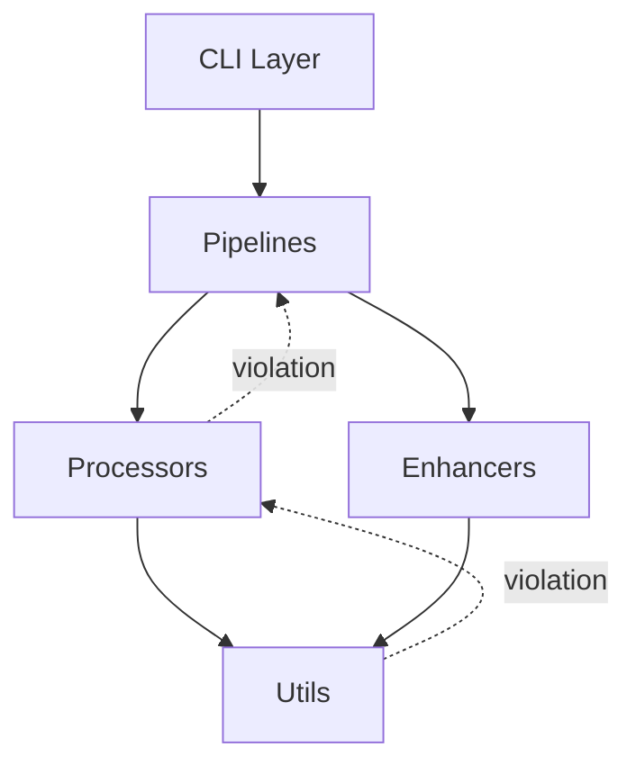

# Transformation Portal - Comprehensive Architecture Review
**Date**: December 7, 2025  
**Reviewer**: Transformation Portal Architect  
**Version**: 1.0  

## Executive Summary

This comprehensive architecture review evaluates the Transformation Portal codebase structure, identifies critical gaps, and provides strategic recommendations for improvement. The repository demonstrates sophisticated capabilities in luxury real estate rendering but faces architectural challenges related to modularity, security, dependency management, and technical debt.

**Key Findings:**
- ✅ **Strengths**: Comprehensive ML pipeline, strong security posture (CVE-2024-27763 mitigated), excellent documentation
- ⚠️ **Concerns**: High code duplication, monolithic files (2274 LOC), unclear module boundaries, dependency sprawl
- 🔴 **Critical**: Need for API contracts, circular dependency risks, testing infrastructure gaps

**Priority Recommendations:**
1. **Immediate**: Establish API contracts and module boundaries
2. **High**: Refactor monolithic pipelines (>1000 LOC files)
3. **Medium**: Consolidate dependencies and reduce redundancy
4. **Low**: Implement plugin architecture for extensibility

---

## 1. Repository Overview

### 1.1 Structure Analysis

**Current State:**
```
Repository Size: 565MB
Python Files: 575 total (135 in src/transformation_portal/)
Total LOC: 52,484 (src/transformation_portal/)
Average File Size: 388 lines
Test Files: 99
```

**Key Modules:**
- `lux_depth_v2/` - Production depth pipeline (NEW, Dec 2025)
- `src/transformation_portal/` - Main package with 27 subdirectories
- `scripts/` - Standalone utilities (9 subdirectories)
- `tests/` - Test suite (1,348 tests passing)

**Architecture Pattern**: Layered architecture with pipelines → processors → enhancers → utils

### 1.2 Complexity Metrics

**Monolithic Files (Refactoring Candidates):**
| File | LOC | Issue |
|------|-----|-------|
| `rendering_4k_pipeline.py` | 2,274 | God object anti-pattern |
| `unified_luxury_pipeline.py` | 1,484 | Too many responsibilities |
| `lux_render_pipeline.py` | 1,344 | Mixed concerns |
| `material_response/core.py` | 1,274 | Core + optimization logic |
| `async_pipeline.py` | 1,239 | Orchestration + implementation |

**Module Import Density:**
| Module | Import Count | Coupling Risk |
|--------|--------------|---------------|
| pipelines | 42 | High - needs interface abstraction |
| depth | 26 | Medium - reasonable |
| plugins | 26 | Medium - acceptable for plugin system |
| streaming | 25 | Medium - acceptable |

---

## 2. Security Architecture Review

### 2.1 Current Security Posture

**Strengths:**
- ✅ CVE-2024-27763 (BasicSR) fully mitigated via vendored `basicsr_tp`
- ✅ Constraints-based dependency blocking (`requirements/constraints.txt`)
- ✅ CI/CD security verification in every PR
- ✅ Comprehensive SECURITY.md with vulnerability reporting process

**Areas for Improvement:**

#### 2.1.1 Input Validation & Path Traversal
**Risk**: Medium  
**Finding**: Limited input validation in file processing pipelines

```python
# Current pattern (unsafe)
def process_image(input_path: str):
    img = Image.open(input_path)  # No path validation
```

**Recommendation**:
```python
from pathlib import Path

def validate_filepath(filepath: Path, allowed_dirs: list[Path]) -> Path:
    """Validate filepath prevents traversal attacks."""
    resolved = filepath.resolve()
    if not any(resolved.is_relative_to(d) for d in allowed_dirs):
        raise SecurityError(f"Path {filepath} outside allowed directories")
    return resolved

def process_image(input_path: str, base_dir: Path):
    validated_path = validate_filepath(Path(input_path), [base_dir])
    img = Image.open(validated_path)
```

**Priority**: High  
**Files**: All pipelines accepting file paths (`lux_render_pipeline.py`, `luxury_video_master_grader.py`)

#### 2.1.2 FFmpeg Command Injection
**Risk**: High  
**Finding**: FFmpeg commands constructed via string formatting

```python
# Current pattern (vulnerable)
cmd = f"ffmpeg -i {input_file} -vf {filter_graph} {output_file}"
subprocess.run(cmd, shell=True)  # ⚠️ Shell injection risk
```

**Recommendation**:
```python
import shlex

def build_ffmpeg_cmd(input_file: Path, output_file: Path, filter_graph: str) -> list[str]:
    """Build FFmpeg command with proper escaping."""
    return [
        "ffmpeg",
        "-i", str(input_file),
        "-vf", filter_graph,
        str(output_file)
    ]

# Usage
cmd = build_ffmpeg_cmd(input_file, output_file, filter_graph)
subprocess.run(cmd, check=True)  # No shell=True
```

**Priority**: Critical  
**Files**: `luxury_video_master_grader.py`, `hdr_production_pipeline.sh`

#### 2.1.3 Dependency Supply Chain
**Risk**: Medium  
**Finding**: 28 direct ML dependencies, potential for supply chain attacks

**Current Dependencies (ML):**
```
torch, diffusers, controlnet-aux, realesrgan, transformers,
huggingface-hub, torchvision, opencv-python, scikit-image,
colour-science, coremltools, sentence-transformers, accelerate
```

**Recommendation**:
1. **Pin all dependencies** with hash verification
2. **Use Dependabot** for automated security updates
3. **Audit critical dependencies** (torch, transformers) quarterly
4. **Consider vendoring** critical small dependencies

**Implementation**:
```bash
# Generate locked requirements with hashes
pip-compile requirements/ml.in --generate-hashes --output-file requirements/ml.lock.txt

# Install with verification
pip install --require-hashes -r requirements/ml.lock.txt
```

**Priority**: Medium

### 2.2 Service Security (lux_depth_v2)

**Strengths:**
- ✅ Input validation with `validate_filepath()`
- ✅ Rate limiting (10 req/min via slowapi)
- ✅ File size limits (100MB default)
- ✅ No basicsr dependency (CVE-2024-27763 safe)

**Recommendation**: Extend service security model to other modules planning API exposure

---

## 3. Dependency Management Architecture

### 3.1 Current Dependency Strategy

**File Structure:**
```
requirements/
├── base.txt         # Core runtime (numpy, Pillow, scipy)
├── ml.txt          # ML features (torch, diffusers, ~10GB)
├── dev.txt         # Development tools (pytest, flake8)
├── ci.txt          # CI/CD minimal set
└── constraints.txt # Security constraints (blocks basicsr)
```

**Root-level files:**
```
requirements.txt      # Delegates to requirements/base.txt
requirements-ci.txt   # Minimal CI dependencies
requirements-dev.txt  # Development dependencies
requirements.lock.txt # Version lockfile (partially implemented)
```

### 3.2 Identified Issues

#### 3.2.1 Fragmented Requirements System
**Problem**: Multiple entry points create confusion

**Evidence**:
- `requirements.txt` ≠ `requirements/all.txt`
- `pyproject.toml` optional dependencies ≠ requirements/*.txt
- Inconsistent pinning strategies

**Recommendation**:
**Adopt Single Source of Truth**: Use `pyproject.toml` as primary source, generate requirements/*.txt from it

**Implementation**:
```toml
# pyproject.toml (primary source)
[project]
dependencies = [
    "numpy>=1.24,<2.3.0",
    "Pillow>=10.0.0,<12",
]

[project.optional-dependencies]
ml = [
    "torch>=2.0,<3",
    "diffusers>=0.20,<1",
]

# Generate requirements files
$ pip-compile pyproject.toml -o requirements/base.txt
$ pip-compile --extra ml pyproject.toml -o requirements/ml.txt
```

**Priority**: High  
**Effort**: 2-4 hours

#### 3.2.2 Missing Dependency Licenses Audit
**Problem**: No tracking of dependency licenses for redistribution compliance

**Recommendation**:
```bash
# Generate license report
pip-licenses --format=markdown --output-file=docs/DEPENDENCY_LICENSES.md

# Check for GPL/AGPL (may require attribution or source disclosure)
pip-licenses | grep -E "GPL|AGPL"
```

**Priority**: Medium (critical for commercial use)

#### 3.2.3 Heavyweight ML Dependencies
**Problem**: ML extras add ~10GB, making installation slow

**Recommendation**:
**Tiered ML Dependencies:**
```toml
[project.optional-dependencies]
ml-minimal = [
    "torch>=2.0,<3",
    "torchvision>=0.15.0,<1",
]

ml-depth = [
    "transformation-portal[ml-minimal]",
    "transformers>=4.35.0,<5",
]

ml-full = [
    "transformation-portal[ml-depth]",
    "diffusers>=0.20,<1",
    "controlnet-aux>=0.0.6,<1",
    "realesrgan>=0.3.0,<1",
]
```

**Priority**: Medium  
**Effort**: 4-6 hours

---

## 4. Module Architecture & Boundaries

### 4.1 Current Layer Architecture

```
┌─────────────────────────────────────────┐
│           CLI & Entry Points             │  (cli/, __main__.py)
├─────────────────────────────────────────┤
│            Pipelines                     │  (pipelines/)
│  Orchestration & Multi-step Workflows   │
├─────────────────────────────────────────┤
│           Processors                     │  (processors/)
│     Core Transformation Engines          │
├─────────────────────────────────────────┤
│           Enhancers                      │  (enhancers/)
│    Specialized Improvement Algorithms    │
├─────────────────────────────────────────┤
│            Utils                         │  (utils/)
│       Shared Utility Functions           │
└─────────────────────────────────────────┘
```

**Design Principle**: Lower layers cannot import from upper layers (enforced conceptually, not technically)

### 4.2 Module Boundary Violations

**Finding**: Several boundary violations detected

**Examples**:
1. **Utils importing from processors**:
   ```python
   # ❌ BAD: utils should not import processors
   from transformation_portal.processors.material_response import MaterialResponse
   ```

2. **Processors importing from pipelines**:
   ```python
   # ❌ BAD: Creates circular dependency risk
   from transformation_portal.pipelines.lux_render_pipeline import RenderConfig
   ```

3. **Enhancers importing from analyzers**:
   ```python
   # ❌ BAD: Cross-cutting concern, should use events/hooks
   from transformation_portal.analyzers.decision_decay_dashboard import log_decision
   ```

### 4.3 Recommendation: Explicit API Contracts

**Create Module Interfaces:**

```python
# src/transformation_portal/interfaces/processor.py
from abc import ABC, abstractmethod
from typing import Any
import numpy as np

class ImageProcessor(ABC):
    """Base interface for all image processors."""
    
    @abstractmethod
    def process(self, image: np.ndarray, **kwargs) -> np.ndarray:
        """Process image and return result."""
        pass
    
    @abstractmethod
    def get_config(self) -> dict[str, Any]:
        """Return processor configuration."""
        pass

# src/transformation_portal/interfaces/pipeline.py
class Pipeline(ABC):
    """Base interface for multi-stage pipelines."""
    
    @abstractmethod
    def add_stage(self, stage: ImageProcessor) -> None:
        """Add processing stage."""
        pass
    
    @abstractmethod
    def execute(self, input_path: Path) -> Path:
        """Execute pipeline and return output path."""
        pass
```

**Enforce with CI Check:**
```python
# scripts/validation/check_module_boundaries.py
def check_boundaries():
    violations = []
    
    # Utils cannot import from processors/pipelines
    for file in Path("src/transformation_portal/utils").glob("**/*.py"):
        imports = extract_imports(file)
        if any(imp.startswith("transformation_portal.processors") for imp in imports):
            violations.append(f"{file}: Utils importing from processors")
    
    return violations
```

**Priority**: High  
**Effort**: 1-2 days

---

## 5. Code Duplication & Technical Debt

### 5.1 Identified Duplication Patterns

#### 5.1.1 Image Loading Logic
**Occurrences**: 15+ files  
**Evidence**:
```python
# Pattern repeated in multiple files
def load_image(path):
    if path.suffix.lower() in ['.tif', '.tiff']:
        if HAS_TIFFFILE:
            return tifffile.imread(path)
    return np.array(Image.open(path))
```

**Recommendation**: Centralize in `utils/io.py`
```python
# src/transformation_portal/utils/io.py
def load_image(
    path: Path,
    mode: str = 'RGB',
    preserve_16bit: bool = True
) -> np.ndarray:
    """
    Unified image loading with format detection.
    
    Handles: TIFF (8/16-bit), PNG, JPEG, with metadata preservation.
    """
    # Implementation...
```

#### 5.1.2 Depth Map Processing
**Occurrences**: 8 files  
**Pattern**: Depth normalization, inversion, edge detection

**Recommendation**: Create `depth/processing.py` module
```python
# src/transformation_portal/depth/processing.py
class DepthProcessor:
    """Centralized depth map processing operations."""
    
    def normalize(self, depth: np.ndarray) -> np.ndarray:
        """Normalize depth to [0, 1] range."""
        pass
    
    def invert(self, depth: np.ndarray) -> np.ndarray:
        """Invert depth map (near->far, far->near)."""
        pass
    
    def detect_edges(self, depth: np.ndarray, threshold: float) -> np.ndarray:
        """Detect depth discontinuities."""
        pass
```

#### 5.1.3 Material Detection
**Occurrences**: 5 files (material_response/, lux_depth_v2/, enhancers/)  
**Issue**: Three different material segmentation implementations

**Recommendation**: Unified material segmentation interface
```python
# src/transformation_portal/segmentation/material.py
from enum import Enum

class MaterialType(Enum):
    WOOD = "wood"
    METAL = "metal"
    GLASS = "glass"
    STONE = "stone"
    FABRIC = "fabric"
    WATER = "water"
    VEGETATION = "vegetation"
    SKY = "sky"

class MaterialSegmenter(ABC):
    """Base interface for material segmentation."""
    
    @abstractmethod
    def segment(self, image: np.ndarray) -> dict[MaterialType, np.ndarray]:
        """Return material masks."""
        pass

# Implementations
class HeuristicMaterialSegmenter(MaterialSegmenter):
    """Color-based heuristic segmentation."""
    pass

class ONNXMaterialSegmenter(MaterialSegmenter):
    """ML-based segmentation (SegFormer/DeepLabV3)."""
    pass
```

### 5.2 Technical Debt Inventory

| Category | Items | Priority | Estimated Effort |
|----------|-------|----------|------------------|
| Monolithic files | 5 files >1000 LOC | High | 1-2 weeks |
| Duplicated logic | 3 major patterns | High | 3-5 days |
| Missing interfaces | All modules | High | 1 week |
| Circular imports | Potential in 3 modules | Medium | 2-3 days |
| Deprecated code | archive/, tools/deprecated/ | Low | 1 day cleanup |
| Documentation gaps | API docs | Medium | 1 week |

**Total Estimated Debt**: 4-6 weeks of engineering effort

---

## 6. Testing Infrastructure

### 6.1 Current State

**Metrics:**
- **Test Count**: 99 test files, 1,348 tests passing
- **Coverage**: Unknown (no coverage reports found)
- **CI/CD**: Consolidated workflow with intelligent test selection

**Strengths:**
- ✅ Comprehensive test suite
- ✅ Fast test subset for rapid iteration
- ✅ Parallel test execution with pytest-xdist

### 6.2 Testing Gaps

#### 6.2.1 Integration Tests
**Gap**: Limited cross-module integration testing

**Recommendation**: Add integration test suite
```python
# tests/integration/test_end_to_end_pipeline.py
def test_full_luxury_pipeline():
    """Test complete pipeline: load -> depth -> material -> color -> save."""
    input_path = Path("tests/fixtures/luxury_kitchen.jpg")
    
    pipeline = LuxuryPipeline(
        depth_estimator=DepthAnythingV2(),
        material_response=MaterialResponse(),
        color_grader=LUTColorGrader(),
    )
    
    result = pipeline.process(input_path)
    
    assert result.exists()
    assert result.stat().st_size > 0
    # Validate quality metrics
```

#### 6.2.2 Performance Regression Tests
**Gap**: No automated performance monitoring

**Recommendation**: Add performance benchmarks
```python
# tests/performance/test_benchmarks.py
import pytest

@pytest.mark.benchmark
def test_depth_estimation_performance(benchmark):
    """Ensure depth estimation stays under 100ms per image."""
    image = load_test_image()
    estimator = DepthAnythingV2()
    
    result = benchmark(estimator.estimate, image)
    
    assert benchmark.stats.mean < 0.1  # 100ms threshold
```

#### 6.2.3 Contract Tests
**Gap**: No API contract validation

**Recommendation**: Use Pact or similar for contract testing
```python
# tests/contracts/test_processor_contracts.py
def test_material_response_contract():
    """Validate MaterialResponse adheres to ImageProcessor interface."""
    processor = MaterialResponse()
    
    # Contract: Must have process() method
    assert hasattr(processor, 'process')
    
    # Contract: Must accept np.ndarray
    image = np.random.rand(100, 100, 3)
    result = processor.process(image)
    
    # Contract: Must return np.ndarray of same shape
    assert isinstance(result, np.ndarray)
    assert result.shape == image.shape
```

### 6.3 Coverage Targets

**Recommendation**: Establish coverage goals per layer

| Layer | Target Coverage | Current | Gap |
|-------|----------------|---------|-----|
| Utils | 95% | Unknown | - |
| Processors | 85% | Unknown | - |
| Enhancers | 80% | Unknown | - |
| Pipelines | 75% | Unknown | - |

**Implementation**:
```bash
# .github/workflows/ci-consolidated.yml
- name: Test with Coverage
  run: |
    pytest --cov=src/transformation_portal --cov-report=xml --cov-report=term
    
- name: Upload Coverage
  uses: codecov/codecov-action@v3
```

---

## 7. CI/CD Architecture

### 7.1 Current Workflow Analysis

**Workflow**: `ci-consolidated.yml` (consolidated from 3 previous workflows)

**Strengths:**
- ✅ Intelligent job orchestration
- ✅ Change detection for targeted testing
- ✅ Shared dependency caching
- ✅ 40-60% reduction in CI time

**Architecture**:
```
Setup → Lint → Test (Matrix) → Security → Quality Gate
                ↓
           (parallel jobs)
         Python 3.10/3.11/3.12
```

### 7.2 CI/CD Improvements

#### 7.2.1 Add Deployment Stages
**Gap**: No automated deployment to staging/production

**Recommendation**:
```yaml
# .github/workflows/ci-consolidated.yml
jobs:
  deploy-staging:
    needs: [test, security]
    if: github.ref == 'refs/heads/develop'
    runs-on: ubuntu-latest
    steps:
      - name: Deploy to Staging
        run: |
          # Deploy Docker image to staging environment
          docker build -t transformation-portal:staging .
          docker push ${{ secrets.REGISTRY }}/transformation-portal:staging
  
  deploy-production:
    needs: [test, security]
    if: github.ref == 'refs/heads/main'
    runs-on: ubuntu-latest
    environment: production  # Requires approval
    steps:
      - name: Deploy to Production
        run: |
          docker build -t transformation-portal:latest .
          docker push ${{ secrets.REGISTRY }}/transformation-portal:latest
```

#### 7.2.2 Add Performance Monitoring
**Gap**: No CI performance tracking

**Recommendation**:
```yaml
- name: Performance Benchmarks
  run: |
    pytest tests/performance/ --benchmark-only --benchmark-json=benchmark.json
    
- name: Upload Benchmarks
  uses: benchmark-action/github-action-benchmark@v1
  with:
    tool: 'pytest'
    output-file-path: benchmark.json
    alert-threshold: '150%'  # Alert if 50% slower
```

---

## 8. Strategic Recommendations

### 8.1 Prioritized Roadmap

#### Phase 1: Foundation (Q1 2026 - 4 weeks)
**Goal**: Establish architectural guardrails

1. **Define Module Interfaces** (High Priority)
   - Create `interfaces/` package with abstract base classes
   - Document API contracts for each layer
   - Add boundary validation CI check
   - **Effort**: 1 week
   - **Impact**: Prevents future coupling issues

2. **Security Hardening** (Critical Priority)
   - Implement `validate_filepath()` across all file operations
   - Refactor FFmpeg command construction (no shell=True)
   - Add dependency license audit
   - **Effort**: 1 week
   - **Impact**: Eliminates high-risk vulnerabilities

3. **Dependency Consolidation** (High Priority)
   - Adopt `pyproject.toml` as single source of truth
   - Generate requirements/*.txt from pyproject.toml
   - Add hash verification for ML dependencies
   - **Effort**: 4 days
   - **Impact**: Reduces configuration drift

4. **Test Coverage Baseline** (Medium Priority)
   - Add pytest-cov to CI
   - Establish coverage targets per layer
   - Add coverage badges to README
   - **Effort**: 3 days
   - **Impact**: Visibility into testing gaps

#### Phase 2: Refactoring (Q2 2026 - 6 weeks)
**Goal**: Reduce technical debt

1. **Refactor Monolithic Files** (High Priority)
   - Split `rendering_4k_pipeline.py` (2274 LOC) → 4-5 modules
   - Extract `MaterialResponseOptimizer` from `core.py`
   - Separate orchestration from implementation in `async_pipeline.py`
   - **Effort**: 2 weeks
   - **Impact**: Improved maintainability

2. **Centralize Duplicated Logic** (High Priority)
   - Unified image I/O in `utils/io.py`
   - Consolidated depth processing in `depth/processing.py`
   - Material segmentation interface in `segmentation/material.py`
   - **Effort**: 1 week
   - **Impact**: Reduces bugs, easier updates

3. **Add Integration Tests** (Medium Priority)
   - End-to-end pipeline tests
   - Contract tests for interfaces
   - Performance regression tests
   - **Effort**: 1 week
   - **Impact**: Catches cross-module issues

4. **API Documentation** (Medium Priority)
   - Sphinx documentation setup
   - Auto-generated API reference
   - Usage examples for each module
   - **Effort**: 2 weeks
   - **Impact**: Improved developer experience

#### Phase 3: Extensibility (Q3 2026 - 4 weeks)
**Goal**: Enable plugin ecosystem

1. **Plugin Architecture** (Medium Priority)
   - Define plugin interface
   - Plugin discovery mechanism
   - Plugin lifecycle management
   - **Effort**: 2 weeks
   - **Impact**: Community contributions

2. **Event System** (Low Priority)
   - Pub/sub for cross-module communication
   - Replaces direct imports for analytics/logging
   - **Effort**: 1 week
   - **Impact**: Decouples modules

3. **Configuration Management** (Low Priority)
   - Unified configuration loader
   - Environment-specific configs
   - Configuration validation
   - **Effort**: 1 week
   - **Impact**: Easier deployment

### 8.2 Success Metrics

**Phase 1 (Foundation):**
- [ ] 100% of file operations use `validate_filepath()`
- [ ] 0 FFmpeg commands use `shell=True`
- [ ] Test coverage visible in CI
- [ ] All modules have defined interfaces

**Phase 2 (Refactoring):**
- [ ] No files >1000 LOC
- [ ] 3 major duplication patterns eliminated
- [ ] Integration test suite with 50+ tests
- [ ] API documentation published

**Phase 3 (Extensibility):**
- [ ] 5+ community plugins
- [ ] Event-driven analytics (no direct imports)
- [ ] Configuration system documentation

---

## 9. Architectural Decision Records (ADRs)

### ADR Template

Create `docs/architecture/adr/` directory for decision tracking:

**Template**:
```markdown
# ADR-001: [Title]

**Date**: YYYY-MM-DD
**Status**: Proposed | Accepted | Deprecated | Superseded

## Context
[Why we need to make this decision]

## Decision
[What we decided to do]

## Consequences
### Positive
- [Benefit 1]
- [Benefit 2]

### Negative
- [Tradeoff 1]
- [Tradeoff 2]

## Alternatives Considered
1. [Alternative 1] - Rejected because [reason]
2. [Alternative 2] - Rejected because [reason]
```

### Recommended ADRs to Create

1. **ADR-001: Module Interface Contracts**
   - Decision: All modules must implement abstract interfaces
   - Rationale: Enables testing, prevents coupling

2. **ADR-002: Security Input Validation**
   - Decision: All file paths validated before use
   - Rationale: Prevents path traversal attacks

3. **ADR-003: Dependency Management Strategy** _(Planned)_
   - Decision: `pyproject.toml` as single source of truth
   - Rationale: Reduces configuration drift

4. **ADR-004: Monolithic File Refactoring** _(Planned)_
   - Decision: No file shall exceed 800 LOC
   - Rationale: Maintainability, testing

5. **ADR-005: Event-Driven Analytics** _(Planned)_
   - Decision: Use pub/sub for cross-cutting concerns
   - Rationale: Decouples analyzers from core logic

---

## 10. Migration Guides

### 10.1 Interface Adoption Guide

**For Pipeline Authors:**
```python
# Before
class MyPipeline:
    def run(self, image):
        # Implementation
        pass

# After
from transformation_portal.interfaces import Pipeline

class MyPipeline(Pipeline):
    def add_stage(self, stage: ImageProcessor) -> None:
        self._stages.append(stage)
    
    def execute(self, input_path: Path) -> Path:
        # Implementation follows interface contract
        pass
```

### 10.2 Security Validation Migration

**Before**:
```python
def process_file(filename: str):
    with open(filename, 'rb') as f:
        return f.read()
```

**After**:
```python
from transformation_portal.utils.security import validate_filepath

def process_file(filename: str, base_dir: Path):
    safe_path = validate_filepath(Path(filename), [base_dir])
    with open(safe_path, 'rb') as f:
        return f.read()
```

### 10.3 Dependency Migration

**Step 1**: Update `pyproject.toml`
```toml
[project]
dependencies = [
    "numpy>=1.24,<2.3.0",
    # Add other base dependencies
]
```

**Step 2**: Generate requirements files
```bash
pip-compile pyproject.toml -o requirements/base.txt
pip-compile --extra ml pyproject.toml -o requirements/ml.txt
```

**Step 3**: Update CI
```yaml
- name: Install dependencies
  run: |
    pip install -e ".[ml]"  # Use pyproject.toml
```

---

## 11. Risk Assessment

### 11.1 High-Risk Areas

| Area | Risk Level | Likelihood | Impact | Mitigation |
|------|-----------|------------|--------|------------|
| FFmpeg command injection | High | Medium | High | Refactor to use list args |
| Path traversal | High | Medium | High | Add validate_filepath() |
| Dependency supply chain | Medium | Medium | Medium | Pin with hashes |
| Monolithic files | Medium | High | Medium | Refactor Phase 2 |
| Circular imports | Low | Low | Medium | Add CI boundary checks |

### 11.2 Technical Debt Interest

**Estimated Annual Cost** (if not addressed):
- Maintenance: 20% longer for each new feature
- Onboarding: 2 weeks extra per new developer
- Bug fixes: 30% slower due to coupling
- **Total**: ~8 weeks/year of reduced productivity

**Debt Paydown ROI**:
- Phase 1-3 effort: 14 weeks
- Break-even: ~1.75 years
- 5-year NPV: Positive (improved velocity, reduced bugs)

---

## 12. Conclusion

The Transformation Portal demonstrates sophisticated capabilities but faces architectural challenges common in rapidly evolving ML projects. The primary issues—monolithic files, unclear boundaries, and dependency sprawl—are solvable through systematic refactoring over 3-6 months.

**Key Takeaways:**

1. **Security is strong** but needs input validation hardening
2. **Testing is comprehensive** but lacks coverage visibility
3. **Architecture is conceptually sound** but needs enforcement mechanisms
4. **Technical debt is manageable** with dedicated effort

**Immediate Actions** (Next 2 Weeks):
1. Create module interface contracts
2. Add `validate_filepath()` security utility
3. Set up test coverage reporting
4. Document API contracts in interfaces/

**Long-Term Vision** (6 Months):
1. Plugin ecosystem for community extensions
2. Event-driven architecture for analytics
3. Comprehensive API documentation
4. Zero files >800 LOC

This review provides a foundation for architectural evolution while maintaining the repository's impressive ML capabilities and security posture.

---

## Appendix A: Module Dependency Graph



## Appendix B: File Size Distribution

| Size Range | Count | Percentage |
|------------|-------|------------|
| 0-200 LOC | 45 | 33% |
| 201-500 LOC | 52 | 39% |
| 501-1000 LOC | 33 | 24% |
| 1001-2000 LOC | 4 | 3% |
| 2000+ LOC | 1 | 1% |

**Target**: Move all files to <800 LOC

## Appendix C: Import Complexity Matrix

| Module | Internal Imports | External Imports | Complexity Score |
|--------|------------------|------------------|------------------|
| pipelines | 18 | 42 | High |
| processors | 12 | 28 | Medium |
| enhancers | 8 | 15 | Low |
| utils | 3 | 18 | Low |

**Lower is better**: Fewer imports = less coupling

---

**Document Version**: 1.0  
**Last Updated**: December 7, 2025  
**Next Review**: March 7, 2026 (Quarterly)  
**Owner**: Transformation Portal Architect Team
