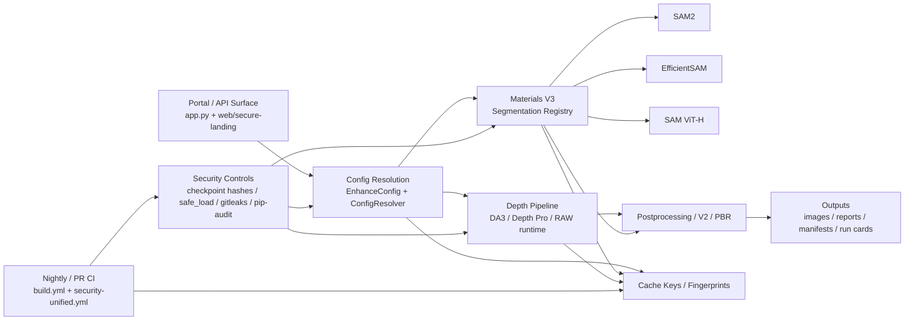
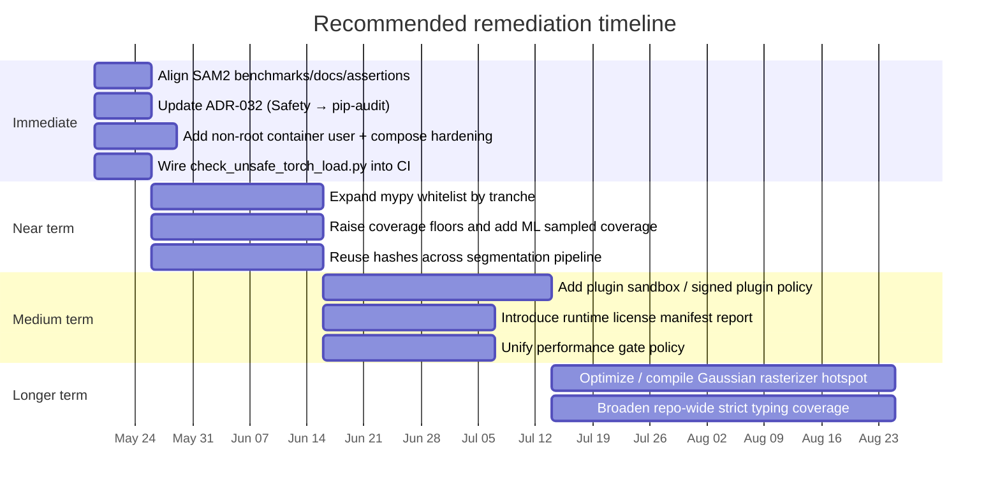

# Repo-Wide Audit - 2026-05-18

**Document Status:** Active baseline (point-in-time static audit)
**Last Updated:** 2026-05-18
**Maintainer:** Repository Architect
**Related Docs:** [DOCUMENTATION_MAP.md](DOCUMENTATION_MAP.md), [PRODUCTION_HARDENING_GAP_2026-05-13.md](PRODUCTION_HARDENING_GAP_2026-05-13.md), [security_best_practices_report.md](security_best_practices_report.md), [COLD_ZONE_COVERAGE_PROGRAM.md](../testing/COLD_ZONE_COVERAGE_PROGRAM.md), [PHASE6_BUDGETS.md](../performance/PHASE6_BUDGETS.md), [sam2_benchmarks.md](../performance/sam2_benchmarks.md)
**Related Scripts:** `scripts/validation/check_unsafe_torch_load.py`, `scripts/security/verify_banned_dependencies.py`, `scripts/ci/check_per_package_coverage.py`, `scripts/ci/check_per_package_branch_coverage.py`
**Related ADRs:** ADR-032 (dependency pinning), ADR-043 (orchestrator decomposition), ADR-044 (test marker enforcement), ADR-045 / ADR-046 / ADR-047 (monolith-decomposition pattern)
**Companion backlog:** [audit/PORTAL_AUDIT_2026-05-18_backlog.md](audit/PORTAL_AUDIT_2026-05-18_backlog.md)

---

## 1. Why this exists

Transformation Portal is a large multi-surface platform: a Python orchestration core, an ML-heavy `src/transformation_portal` package, a second `src/tp` import surface for contract/fixity/phase tooling, the `web/secure-landing/` Node 22 frontdoor, extensive scripts, governed CI, and formal ADRs. Prior audits (`security_best_practices_report.md` on the API/runtime surface, `PRODUCTION_HARDENING_GAP_2026-05-13.md` on paid-pilot durability) cover narrow slices. This document is the empirical baseline for a single, broad, static repo-wide pass dated 2026-05-18.

The overall conclusion is that the repo is **governance-heavy and unusually mature in artifact integrity controls, but still carries concentrated risk in three places**: (1) enforcement coverage is selective rather than universal; (2) ML hot paths have obvious CPU/GPU bottlenecks; (3) container and plugin isolation lag the code-level hardening. None of these is a release blocker on its own; together they describe where the next quarter of platform hardening should land.

## 2. Methodology

Static, read-only audit performed against the working tree at `origin/main` head plus the `claude/optimize-portal-audit-gYdHm` branch on 2026-05-18. No code execution, no container build, no test runs, no checkpoint downloads, no inspection of private CI logs, branch protection rules, or org-level secrets. Findings reflect repository state visible from the working tree and existing external documentation only.

Every citation below is a real `path` or `path:line` reference verified during this audit. Where the verification did not record a specific line, only the path is cited. Absence claims (e.g., "no `USER` directive in Dockerfile") were checked with explicit greps and reads against the inspected file; they reflect the state of the working tree at the audit commit, not dynamic proof that the surface cannot appear at runtime.

## 3. Inspected surface

- Top-level packaging and policy: `README.md`, `app.py`, `pyproject.toml`, `LICENSE`, `.env.example`, `Dockerfile`, `docker-compose.yml`, `mypy.ini`, `.pre-commit-config.yaml`, `.gitleaks.toml`, `SECURITY.md`.
- Architecture and governance docs: `docs/architecture/ARCHITECTURE.md`, `docs/ci/WORKFLOW_MATRIX.md`, `docs/testing/COLD_ZONE_COVERAGE_PROGRAM.md`, `docs/performance/README.md`, `docs/performance/PHASE6_BUDGETS.md`, `docs/performance/sam2_benchmarks.md`, `docs/architecture/ADR-032-dependency-pinning-strategy.md`.
- Dependencies and enforcement: `requirements/base.in`, `requirements/security.in`, `requirements/constraints.txt`, `requirements/lock_ownership.yml`, `scripts/validation/check_unsafe_torch_load.py`, `scripts/security/verify_banned_dependencies.py`, `scripts/security/banned_dependencies.json`, `scripts/ci/check_per_package_coverage.py`, `scripts/ci/check_per_package_branch_coverage.py`.
- ML runtime surfaces: `src/transformation_portal/spatial_ai/segmentation/sam2_backend.py`, `src/transformation_portal/lux_depth_v3/config.py`, `src/transformation_portal/lux_depth_v3/segmentation/_cache.py`, `src/transformation_portal/spatial_ai/reconstruction/gaussian_rasterizer.py`, `src/transformation_portal/core/security/torch_security.py`, `src/transformation_portal/core/raw_runtime.py`, `src/transformation_portal/vlm_captioning/fastvlm_runtime.py`, `src/transformation_portal/vlm/__init__.py`, `src/transformation_portal/vlm/llava.py`, `src/transformation_portal/plugins/loader.py`.
- CI workflows and tests: `.github/workflows/build.yml`, `.github/workflows/security-unified.yml`, `tests/spatial_ai/segmentation/test_sam2_backend_performance.py`, `tests/spatial_ai/reconstruction/test_performance_budgets.py`.

## 4. Architecture and runtime map

The repository is an orchestration layer that resolves typed config, chooses depth and segmentation backends, runs governed subprocess or in-process ML stages, and emits manifests, run cards, and governance artifacts. Two top-level import surfaces are both public: `src/transformation_portal/` (the main package) and `src/tp/` (separate surface for contract, fixity, and phase tooling). CI verifies both paths in source-tree and wheel-installed contexts; they must not be collapsed.



Three runtime design choices materially shape risk and performance:

- **Subprocess-isolated runtimes** for heavy or optional ML stages. RAW and FastVLM both build list-based argv, set explicit working directories and environments, and enforce timeouts (`src/transformation_portal/core/raw_runtime.py:273-296`, `src/transformation_portal/vlm_captioning/fastvlm_runtime.py:285-332`). That is the correct command-injection posture.
- **Config-determined fingerprints**. `EnhanceConfig` carries `sam2_model_config` and `sam2_expected_sha256` (`src/transformation_portal/lux_depth_v3/config.py:415,420,423`), and those flow into Materials V3 fingerprints and cache keys so replay cannot silently bypass changed integrity assumptions.
- **Modern PyTorch load policy**. `torch_security.py` sets a `MINIMUM_SUPPORTED_TORCH_VERSION = "2.8.0"` baseline (`src/transformation_portal/core/security/torch_security.py:55`), funnels loads through `weights_only=True` (line 109), and supports global enforcement (lines 258-316). The supported baseline is above the `torch.load` RCE fix published as CVE-2025-32434, so the supply-chain floor is correct.

## 5. Findings — priority table

| # | Issue | Location | Severity | Effort |
|---|---|---|---:|---:|
| 1 | Type-check gate is whitelist-based, not repo-wide | `mypy.ini:7`, `.github/workflows/build.yml:567-573` | High | M |
| 2 | Coverage enforcement is fragmented and relatively permissive | `.github/workflows/build.yml:722-728`, `docs/testing/COLD_ZONE_COVERAGE_PROGRAM.md`, `docs/performance/README.md` | Medium | M |
| 3 | SAM2 benchmark expectations are internally inconsistent | `docs/performance/sam2_benchmarks.md:13`, `tests/spatial_ai/segmentation/test_sam2_backend_performance.py:14,296` | Medium | S |
| 4 | Segmentation cache/fingerprint builders hash entire images and checkpoint files in hot paths | `src/transformation_portal/lux_depth_v3/segmentation/_cache.py:183-190`, `src/transformation_portal/spatial_ai/segmentation/sam2_backend.py:556-570` | Medium | M |
| 5 | Reconstruction rasterizer still loops in Python over splats | `src/transformation_portal/spatial_ai/reconstruction/gaussian_rasterizer.py:346-374`, `tests/spatial_ai/reconstruction/test_performance_budgets.py:33` | High | L |
| 6 | Container hardening lags code hardening (no non-root `USER`) | `Dockerfile`, `docker-compose.yml` | Medium | S |
| 7 | External plugin execution is opt-in but unsandboxed | `src/transformation_portal/plugins/loader.py:18-150` | Medium | M |
| 8 | Dependency/security governance docs drift from current toolchain (ADR-032 still names `safety`) | `docs/architecture/ADR-032-dependency-pinning-strategy.md:170`, `requirements/security.in:20-24`, `.github/workflows/security-unified.yml:167-170` | Low | S |
| 9 | Mixed software/model licensing needs stricter operator-facing compliance surfacing | `LICENSE`, `src/transformation_portal/lux_depth_v3/config.py` | Medium | M |
| 10 | Unsafe-`torch.load` scanner exists but is not wired into CI or pre-commit (CVE-2025-32434 hardening documented, not enforced) | `scripts/validation/check_unsafe_torch_load.py`, `.github/workflows/build.yml`, `.github/workflows/security-unified.yml`, `.pre-commit-config.yaml` | Medium | S |

## 6. Findings — detail

### 6.1 Code quality, typing, and test enforcement

**Finding 1 — Whitelist-based type gating.** `mypy.ini:7` sets `ignore_missing_imports = True`, which is reasonable on an ML-heavy codebase but limits defect detection. The type-check job in `.github/workflows/build.yml:567-573` only runs mypy over `src/transformation_portal/api/`, `src/transformation_portal/lux_depth_v3/`, `src/transformation_portal/core/geometry/`, `src/transformation_portal/core/processing/`, `src/transformation_portal/core/ml_dependency_health.py`, and `src/transformation_portal/core/da3_runtime.py`. This is good tranching, but it is coverage of critical islands, not a typed repository. The in-comment policy is explicit: "do NOT enable `core/` as a whole until all 21 currently-failing files are fixed" (`build.yml:565`). The follow-up should expand the whitelist by tranche.

**Finding 2 — Coverage strategy is intentionally selective.** `build.yml:722-728` enforces a 25% global floor for the core PR lane (`--cov-fail-under=25`) and skips coverage entirely for the ML PR lane (`COV_FLAGS="--no-cov"`). Per-package floors are enforced separately by `scripts/ci/check_per_package_coverage.py` and `scripts/ci/check_per_package_branch_coverage.py`. The cold-zone program (`docs/testing/COLD_ZONE_COVERAGE_PROGRAM.md`) tracks ratchet PRs for `events/`, `storage/`, `runtime/`, `lux_depth_v3/`, `hardening/`, and `app.py`. This is a defensible CI-cost decision but means changes in the ML-heavy surface can land with weaker observable coverage than the repo's governance tone implies. A lightweight ML sampled-coverage slice plus a slow ratchet of the 25% floor closes the gap without doubling CI minutes.

Positive note: the cold-zone program identified `transformation_portal.vlm` eager imports as a blocker, and that has been resolved. `src/transformation_portal/vlm/__init__.py:20-33` now uses lazy `__getattr__` exports, and `src/transformation_portal/vlm/llava.py:30-47` guards torch/transformers imports with actionable errors. Non-ML lanes are now safe to import this package.

### 6.2 Runtime and performance

**Finding 3 — SAM2 benchmark inconsistency.** The benchmark doc records 13.38 s mean latency and 1673 MB peak memory for 512×512 auto mode on MPS (`docs/performance/sam2_benchmarks.md:13`). The benchmark test's docstring still says "Baseline: < 2s on MPS, < 5s on CPU" (`tests/spatial_ai/segmentation/test_sam2_backend_performance.py:14`), while the actual assertion accepts `metrics["mean_sec"] < 20.0` with the comment "MPS baseline: ~13.5s" (line 296). Docstring, assertion, and doc baseline must agree before this benchmark is trustworthy as a regression signal.

**Finding 4 — Hash duplication in ML hot paths.** `src/transformation_portal/lux_depth_v3/segmentation/_cache.py:183-190` (`_stable_array_hash`) hashes full contiguous arrays for cache keys. `src/transformation_portal/spatial_ai/segmentation/sam2_backend.py:556-570` (`_stable_image_hash`) does the same on input images, and the SAM2 checkpoint is also rehashed for explicit SHA-256 integrity validation (`sam2_backend.py:66-72,318-324,369-370`). Both contribute to correctness, but a large image can be fully scanned for hash purposes before segmentation even begins. Thread a single content digest through config resolution, cache keys, and runtime metadata; memoize checkpoint digests by inode/size/mtime for the duration of one run. The integrity validation itself (typed `SAM2CheckpointIntegrityError` at `sam2_backend.py:83-84`) should stay — it is a strong fail-closed control.

**Finding 5 — Gaussian rasterizer per-splat Python loop.** After projection and inverse-covariance prep, `src/transformation_portal/spatial_ai/reconstruction/gaussian_rasterizer.py:346-374` loops `for i, bounds in enumerate(bounds_by_splat):`, builds fresh per-splat coordinate grids, evaluates weights, and composites patches one splat at a time in Python. This is a correct first PyTorch implementation but the opposite of the vectorized/compiled approach needed as Gaussian count or render size grows. The nightly performance budget only covers a 96-Gaussian × 64×64 CPU fixture (`tests/spatial_ai/reconstruction/test_performance_budgets.py:33`), so it is a regression sentinel rather than evidence of scalability. If reconstruction stays strategic, this becomes the highest-value optimization target: batch windows, tile splats, or move compositing to a compiled or Triton path.

### 6.3 Security

**Finding 6 — Container default is root.** No `USER` directive appears in any of the four `Dockerfile` stages (base, cpu, gpu, apple-silicon), and `docker-compose.yml` does not set `user:` on any service. The Python process therefore runs as root, which widens the blast radius of any compromise. Adding a dedicated unprivileged user, chowning writable paths, and preferring a read-only root filesystem with tmpfs exceptions is one of the cheapest posture improvements available.

**Finding 7 — Plugin loader trust boundary.** `src/transformation_portal/plugins/loader.py:18-150` is secure-by-default: external plugin discovery is opt-in via an explicit environment toggle (`_ENABLE_EXTERNAL_PLUGINS_ENV`) and an `allow_external_plugins` parameter on `PluginLoader`. Once enabled, manifest discovery (`PluginManifest.from_json_file`, `from_pyproject`) and class instantiation happen inside the main process trust boundary. Acceptable for a controlled local-extension story; not acceptable for a hostile-multi-tenant or marketplace story. If external plugins are intended to remain part of the roadmap, either require signed manifests with explicit trust policy or run plugins in a separate worker boundary with a small API surface.

**Finding 10 (new in this audit) — Unsafe-`torch.load` scanner is orphaned.** `scripts/validation/check_unsafe_torch_load.py` exists and is fully implemented (355 lines, allowlist of approved files including `torch_security.py` and tests, comment/docstring-aware regex, fix-suggestion output, distinct exit codes for clean / violations / error). CVE-2025-32434 mitigation is in the script header. However, no reference to the scanner exists in `.github/workflows/build.yml`, `.github/workflows/security-unified.yml`, or `.pre-commit-config.yaml`. The policy is therefore enforceable but unenforced. Wire the scanner into `.pre-commit-config.yaml` and as a non-blocking step in `security-unified.yml`, then promote to blocking after one quiet week.

Positive context: the rest of the model-loading posture is strong. `torch_security.py` sets the supported baseline at `MINIMUM_SUPPORTED_TORCH_VERSION = "2.8.0"` (line 55), centralizes `safe_load()` with enforced `weights_only=True` (line 109), and provides `install_global_enforcement()` (lines 258-316). Subprocess wrappers (RAW at `raw_runtime.py:273-296`, FastVLM at `fastvlm_runtime.py:285-332`) use list-based argv, no `shell=True`, and explicit timeouts. Banned-dependency enforcement is wired via `scripts/security/verify_banned_dependencies.py` against `scripts/security/banned_dependencies.json` and `requirements/constraints.txt:8` (which hard-blocks `realesrgan` with `realesrgan>=9999.0.0`). GitHub Actions are pinned to commit SHAs across both inspected workflows (`build.yml:49,128,475`, `security-unified.yml:62`).

#### Dependency snapshot

| Package family | Evidence | Risk mode | Action |
|---|---|---|---|
| `torch` | `requirements/base.in`, `torch_security.py:55` | Unsafe deserialization, native surface | Baseline ≥ 2.8.0 enforced; keep |
| `Pillow` | `requirements/base.in` | Image parser CVEs | Track upstream releases quarterly |
| `transformers`, `sentence-transformers` | `requirements/base.in`, `vlm/llava.py` | Remote model loading | Pin revisions everywhere remote loading occurs |
| `rawpy`, `rasterio`, `open3d`, `onnxruntime`, `opencv` | `requirements/base.in` | Native parser surfaces | Keep in enhanced-scrutiny inventory |

### 6.4 CI, governance, and licensing

**Finding 8 — ADR-032 toolchain drift.** `docs/architecture/ADR-032-dependency-pinning-strategy.md:170` still lists `safety` under "Security Monitoring Tools" as the automated CVE scanner. `requirements/security.in:20-24` explicitly documents the March 2026 removal of Safety in favor of pip-audit, and `.github/workflows/security-unified.yml:167-170` carries a matching comment ("Safety scanning removed per security toolchain governance cleanup; pip-audit … is the governed blocking dependency scanner"). Not a runtime defect, but exactly the kind of governance drift that erodes audit trust. Update ADR-032 to reflect the current toolchain and the severity policy enforced by pip-audit.

**Finding 9 — Mixed software and model licensing.** The repository itself is governed by a proprietary, non-commercial, no-ML-use `LICENSE` that explicitly prohibits training, benchmarking, embedding extraction, and large-scale automated extraction. At the runtime layer, the default DA3 research backend is CC BY-NC 4.0, and `EnhanceConfig` carries explicit acceptance flags for research-only licenses such as Apple Depth Pro (`src/transformation_portal/lux_depth_v3/config.py`). Operators therefore need both software-license and model-license compliance tracked at runtime, not just at install time. The cheapest improvement is a machine-readable license manifest in run cards or manifests showing software tier, model tier, and whether non-commercial or research-only surfaces were active during a run.

Positive context: dependency governance is unusually explicit. ADR-032 defines constraint styles, banned packages, and enforcement intent; `requirements/lock_ownership.yml` assigns owners and update cadences across `all.txt`, `base.txt`, `dev.txt`, `ci.txt`, `security.txt`, `tools-archive.txt`, and `ml-core-darwin-arm64.txt`. Banned-dependency enforcement is real.

## 7. Remediation roadmap



The companion backlog at [audit/PORTAL_AUDIT_2026-05-18_backlog.md](audit/PORTAL_AUDIT_2026-05-18_backlog.md) lists the 12 actionable items with file targets and acceptance criteria.

## 8. Open questions and limitations

Branch protection rules, required-check policies, private SARIF outputs, and historical CI flake rates are not visible from repo contents alone and were not verified. A definitive SBOM and full transitive-license inventory are out of scope; the repo has strong dependency governance and explicit model-license flags, but full legal certification would need lockfile-to-license expansion and human review of third-party model terms.

Absence claims (e.g., "no `USER` directive in Dockerfile", "no reference to `check_unsafe_torch_load.py` in pre-commit") were checked with explicit greps and reads against the inspected files. They are not dynamic proof that the surfaces cannot fire at runtime.

## 9. Validation

```bash
make ci
make check-stale-docs
make check-doc-heading-links
python3 scripts/security/verify_banned_dependencies.py
python3 scripts/validation/check_unsafe_torch_load.py
python3 scripts/ci/check_per_package_coverage.py
python3 scripts/ci/check_per_package_branch_coverage.py
```

The first three confirm doc and governance topology; the rest re-verify the security and coverage controls cited above.
