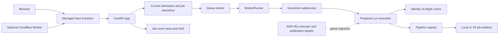

# Architecture Integrity Audit — 2026-09-12

**Classification:** Dated source review and local validation evidence.
**Baseline:** `b4ce44942a7e611479a79b96bb07ccd8260a9fa3` (`origin/main`).
**Implementation:** Local branch `codex/architecture-integrity-audit-20260913`.
**Authority:** Existing contracts and ADRs remain authoritative. This report
does not activate a new executor, approve a deployment, or certify every module.

**Follow-up:** The [remediation report](ARCHITECTURE_REMEDIATION_2026-09-12.md)
records the subsequently requested tenant, distributed-authority, security,
typing and real-service/production-image work. Findings below remain the dated
initial assessment.

## Assessment

The highest-value improvements are at resource and authority boundaries:
lease renewal to process cancellation, stream ownership, input preparation,
cache admission, and artifact fingerprinting. The repository already has
substantial canonical-plan, identity, path, dependency, and API contract
coverage. Its existing tests nevertheless missed several reproducible failure
paths. Focused repairs preserve those contracts and reduce the custom SSE
forwarding code by using native stream lifecycle propagation.

Production scaling remains conditional. Multi-host admission, authenticated
tenant binding, fenced publication, and trusted dispatch locators require the
existing ADR-051 work. Replacing the current executors or rewriting the portal
would not resolve these boundaries by itself.

## Scope and method

Four parallel reviews traced actual consumers, reproduced failures before
editing, and independently reviewed the resulting patches. The baseline
includes the security boundary fixes in PR #2130 and documentation refresh in
PR #2129; neither is treated as unfinished work.

| Area | Review depth and evidence |
| --- | --- |
| Managed frontdoor | Access JWT/session/CSRF checks, proxy headers, upstream error envelopes, SSE cancellation and byte preservation; Node contracts, production build, live managed login/logout smoke. |
| Backend and orchestration | Active request/tenant/admission paths, worker acquisition/renewal/release, cancellation, process groups, stdout failure, terminal events, recovery, and repository interfaces; real local subprocess regressions and contract tests. |
| Execution integrity | Native and consumed plans, portable input names, source descriptor snapshots, identity-v3 cache admission/locking/accounting, and evidence authority; regression, concurrency, and mypy checks. |
| Artifact storage | Local/S3 delivery, fingerprint limits, stale HEAD versus GET observations, size consistency, and body cleanup; fake streaming responses and local/moto contracts. |
| Supply chain and CI | Current locks, download checksums, unsafe checkpoint loads, Action pins, firewall checkout provenance, effective GitHub branch rules and open security alerts. |
| Architecture direction | Current construction/consumer paths compared with the cleanup board and ADR-051; accepted migration gaps separated from new defects. |

This is a repository-wide boundary audit with detailed testing of the affected
paths, not a line-by-line proof of all source. Real Redis/Postgres/S3 outage
injection, multi-host chaos testing, model inference, production TIFF throughput,
and hosted exact-head CI were not performed. Passing synthetic tests cannot
establish those results.

## Current authority map



The frontdoor owns browser authentication; API-key injection stays server-side.
The backend owns typed API envelopes, admission, lifecycle and artifact access.
Lux preparation freezes the execution contract before backend initialization.
`src/tp` remains the separate public cryptographic/evidence surface. Job history,
mutable job snapshots, artifacts and signed evidence are distinct authorities.

## Reproduced defects and implemented repairs

Priorities reflect impact under the stated trigger, not a claim of unauthenticated
remote exploitability. All changes are local and reviewable.

| Priority | Trigger and baseline failure | Implemented repair | Regression evidence |
| --- | --- | --- | --- |
| P1 | Redis heartbeat raises `ConnectionError`/`TimeoutError`: executor continues without renewal, heartbeat exception skips lease release, supervisor exits. | Cancel on uncertain renewal; contain release failures for reclaim; acquisition failures use existing capped backoff. | Worker unit tests exercise renewal, release, acquisition recovery and `CancelledError` propagation. |
| P1 | A broker cancels a silent child, or a runner encounters an oversized stdout line/task cancellation: child remains alive after failure. Peer review also reproduced surviving descendants and overwritten terminal outcomes. | Retain verified process-group ownership across leader exit, bound TERM/KILL and pipe cleanup, and preserve already published terminal outcomes. | Real children cover silence, oversized lines, pipe backpressure, resistant descendants before/after leader exit, detached pipes, and unchanged `worker_lost`/`canceled` results with one terminal event. |
| P2 | A browser abandons an idle SSE stream, upstream streaming fails, or a 503 body is discarded: the backend body remains open or truncation appears as clean EOF. | Native `pipeTo` forwards backpressure/cancellation/errors; fetch follows request abort; discarded error bodies close. | Four Node regressions plus existing byte/framing/auth tests. |
| P2 | `mkdtemp`, `chmod`, or nested directory creation fails after opening a prepared input: source FD/private directories leak. | Put all setup under FD cleanup, remove only owned temporary trees, preserve existing shared destination files. | Injected ENOSPC/permission/partial-directory failures and destination preservation tests. |
| P2 | A depth array cannot fit its configured cache quota: full NPY serialization/hashing occurs before rejection. | Reject provably oversized arrays before serialization; preserve locked quota resize and exact serialized accounting. | No-serialization tests for zero/undersized quotas and resize; concurrency suite retained. |
| P2 | A canonical carried plan contains case/Unicode-equivalent input names: consumption accepts a selection native preparation rejects. | Apply the same portable uniqueness rule before filesystem binding. | Case and Unicode collisions rejected without changing the plan schema. |
| P2 | An S3 object grows between HEAD and GET: fingerprinting trusts HEAD and reads/hashes beyond its configured limit. | Validate GET length and observed bytes, stop at cap plus one detection byte, withhold fingerprints on size mismatch, always close body. | 23 cases cover head/list, missing or stale length, exact cap, oversized chunks, read failure and cancellation. |
| P2 | Cold pre-commit batches invoke the lint bootstrap concurrently: multiple `ensurepip`/pip writers corrupt the same environment. | Serialize bootstrap-owning formatter hooks while preserving full file scope and tool pins. | Hook contract tests and a complete pre-commit rerun. |

Implementation and tests:

- [Worker lifecycle](../../../src/transformation_portal/orchestrator/worker.py),
  [subprocess integration](../../../app.py),
  [worker regressions](../../../tests/orchestrator/test_worker_runner_unit.py),
  [process regressions](../../../tests/test_app_orchestrator_runtime.py),
  [process-group contracts](../../../tests/orchestrator/test_process_termination.py).
- [SSE proxy](../../../web/secure-landing/app/v1/%5B...path%5D/route.js) and
  [route contracts](../../../web/secure-landing/tests/routes.test.mjs).
- [Prepared snapshots](../../../src/transformation_portal/lux_depth_v3/orchestrator.py),
  [plan consumption](../../../src/transformation_portal/lux_depth_v3/execution_lifecycle.py),
  [cache admission](../../../src/transformation_portal/lux_depth_v3/depth_cache.py),
  [lifecycle regressions](../../../tests/lux_depth_v3/test_execution_lifecycle.py),
  [cache regressions](../../../tests/lux_depth_v3/test_depth_cache_identity_v3.py).
- [S3 fingerprinting](../../../src/transformation_portal/orchestrator/artifact_store/s3.py)
  and [artifact contracts](../../../tests/orchestrator/test_artifact_store_contract.py).
- [Pre-commit hook configuration](../../../.pre-commit-config.yaml) and
  [bootstrap serialization contracts](../../../tests/structural/test_pre_commit_runtime_contract.py).

## Measured allocation improvement

The same synthetic 4096 by 4096 float32 array (64 MiB) was offered to a 1 MiB
cache, measuring additional Python allocation with `tracemalloc`.

| Measurement | Baseline | Repaired |
| --- | ---: | ---: |
| Peak additional Python allocation | 83,888,589 bytes | 11,619 bytes |
| Single observed elapsed time | approximately 0.029 seconds | 0.001178 seconds |
| Accepted/published | No | No |

The deterministic improvement is avoiding serialization for a write that cannot
fit. The one-run timings are descriptive, not a benchmark baseline or evidence
of inference speedup, total process RSS, or production batch throughput.

## Unresolved security and deployment gates

### P1: dependency-security results are not required by merge protection

Live GitHub branch protection requires strict `CI Gate`, enforces admins, and
disallows forced updates/deletion. Applicable rules additionally require
CodeQL/code-quality evaluation. However, `CI Gate`'s `needs` in
[build.yml](../../../.github/workflows/build.yml) excludes the independent
`Dependency Security` job in
[security-unified.yml](../../../.github/workflows/security-unified.yml).
The workflow comment claiming it is required for merge does not establish that
requirement in GitHub. Dependency Review is advisory.

Next action: align the required-check policy with the intended security
workflow, including trigger/skip behavior, and verify it on a concrete PR.
Until then, assess dependency-security results explicitly before release.
This audit changed neither repository rules nor alert dispositions.

### P1 deployment constraint: untrusted Accelerate checkpoints remain unsupported

The live open Dependabot inventory contains exactly two alerts,
[#425](https://github.com/RC219805/Transformation_Portal/security/dependabot/425)
and [#428](https://github.com/RC219805/Transformation_Portal/security/dependabot/428),
for one medium-severity advisory:
[GHSA-4j2p-28q2-5m79](https://github.com/advisories/GHSA-4j2p-28q2-5m79).
The advisory lists no patched release; the
[v1.15.0 loader](https://github.com/huggingface/accelerate/blob/v1.15.0/src/accelerate/utils/modeling.py#L1936-L1944)
still joins unvalidated shard paths. The supported lock's 1.14.0 pin is not
changed speculatively. Follow [SECURITY.md](../../../SECURITY.md): reviewed,
trusted checkpoints only until containment and non-regular-file rejection are
verified upstream and the native target lock is regenerated.

### Existing ADR-051 prerequisites

These were reverified in current consumers. They are existing migration work,
not newly reopened cleanup items.

| Priority / prerequisite | Current boundary | Evidence required before expansion |
| --- | --- | --- |
| P1: authenticated tenant binding | `_pilot_tenant_from_request` reads a configurable header; the frontdoor does not derive tenant identity from the authenticated actor. | Trusted upstream must overwrite the header; prove cross-tenant request/artifact denial before untrusted multi-tenant use. |
| P1: atomic admission and dispatch | `JOB_ADMISSION_LOCK` is process-local; broker payloads carry executable `argv`. | Transactional capacity/outbox/once-only claims and locator-only workers, with isolated trusted broker during migration. |
| P1: publication fencing | Current artifact finalization writes objects individually; job state/events/publication are not one fenced database commit. | Stale-holder, duplicate-delivery, crash and generation-visibility tests on real services. |
| P2: retained event growth | Postgres events append until job deletion cascades; no independent per-job event cap. | Bounded growth policy with replay-gap semantics, operational measurements and contract tests. |
| P2: executor convergence | Target StageGraph/CASDAG components do not establish current production authority. | Applicable Lux and Spatial vertical-slice parity, security, output and performance gates before activation. |

Use the existing [ADR-051](../../architecture/ADR-051-execution-artifact-authority-designation.md)
and [cleanup board](../../architecture/ARCHITECTURE_CLEANUP_BOARD.md) for the
implementation sequence. Do not combine cryptographic evidence stores with
mutable operational records, or add another scheduler to solve these gaps.
Issues #2063, #2064 and #2065 were rechecked and are closed; their landed
evidence-write, cache-identity and planning work is not reopened here.

## Security controls reverified

- All 226 active remote Action references across 31 workflows use full SHA pins.
- The post-CI firewall admits successful same-repository push/manual runs and
  checks out the triggering SHA. `pull_request_target` triage performs no checkout.
- The PyPI environment requires owner approval.
- Gitleaks, SAM2 and Real-ESRGAN downloads have checksum gates; FastVLM uses
  manifest hashes/revisions; the DA3 installer verifies the governed lock digest.
- Live open code-scanning and secret-scanning inventories were empty. This is
  scanner evidence, not proof that no vulnerabilities or secrets exist.
- The unsafe checkpoint-load scanner reported zero violations across 1,797 files.

## Validation and practical limits

Local validation used Python 3.12.13 and Node 22.22.2. The isolated frontend
installation was restored with `npm ci` from the checked-in lock; no dependency
manifest or compiled lock changed. The initial borrowed installation had
`js-yaml` 4.3.1 instead of locked 4.3.2 and failed its security regression.
That environment mismatch was resolved by the isolated install.

The initial browser launch could not open its DevTools endpoint in the sandbox;
the authorized isolated rerun outside the sandbox passed. The cold lint bootstrap
race was repaired without relaxing formatting checks.

Commands below run from the audit worktree with Node 22 on PATH:

```bash
PYTHONPATH=src:. make ci
PYTHONPATH=src:. make ci-quick
PYTHONPATH=src:. make test-fast
PYTHONPATH=src:. make validate-ci
PYTHONPATH=src:. make pre-commit
PYTHONPATH=src:. make validate-frontdoor-browser
PYTHONPATH=src:. .venv/bin/python -m pytest tests/security tests/test_app_security.py tests/test_config_loader_security.py tests/test_validate_ci_config.py tests/test_security_unified_workflow.py -q
PYTHONPATH=src:. .venv/bin/python -m pytest tests/core/test_execution_plan.py tests/core/test_execution_identity_v3.py tests/lux_depth_v3/test_execution_lifecycle.py tests/lux_depth_v3/test_depth_cache_identity_v3.py tests/lux_depth_v3/test_depth_cache_runtime.py tests/lux_depth_v3/test_depth_cache_concurrency.py tests/lux_depth_v3/test_execution_evidence.py tests/lux_depth_v3/test_prepared_execution_callsites.py -q
git diff --check
make check-worktree
```

Recorded results: full local `make ci` passed with 1,004 orchestrator tests
passing / 9 skipped; security baseline 770 passed / 4 skipped; focused
execution/cache ladder 458 passed; artifact suite 163 passed;
frontend 292 passed with production build; fast suite 77 passed; managed browser
smoke passed. Counts overlap and must not be summed as unique coverage.
Pre-commit passed from a fresh lint environment. Documentation structure,
heading links, Unicode-control scanning and diff whitespace checks passed.
Worktree cleanliness is checked after saving the local commit.

Scoped mypy passed for the three changed Lux source modules. A supplemental
`PYTHONPATH=src:. .venv/bin/python -m mypy --config-file=mypy.ini app.py` check
reported 15 errors. The exact baseline `app.py` reproduced the same diagnostics
(apart from shifted line numbers): this is existing typing debt, not a new
regression or an environment failure. Follow the existing mypy-tranche policy
before promoting the whole application into a blocking typed surface.

Process groups provide cleanup authority, not a security sandbox. A descendant
that deliberately creates another session is outside the saved group's
authority; its inherited pipe is closed after bounded cleanup. Native Windows
process-tree behavior was not exercised; direct-child fallback is contract-tested.

Service skips are environment/opt-in limits. Local and moto S3 results do not
prove real S3 behavior; injected broker exceptions do not prove real Redis
failover or Postgres transaction behavior. No ML runtime, host topology,
selectors, route shapes, envelopes, schema version, dependency baseline or
deployment configuration was changed.

Raw local logs and compact GitHub snapshots are retained at
`/private/tmp/tp-architecture-audit-evidence/`. They are disposable evidence,
not committed build artifacts. This branch has not been pushed, merged or
deployed by this audit.
